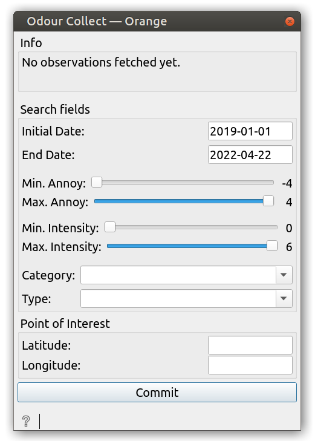

#  Mecoda-Orange 

Orange Data Mining Widgets to analyse data from science citizen observatories.

This repository includes different Orange Data Mining widgets to access data from Natusfera and Odour Collect APIs. 

##  Natusfera widget 

The widget collect observations from Natusfera API and allows filter them by:

| Argument | Descrition | Example |
| --------- | ----------- | ------- |
| `Search by words` | Word or phrase found in the data of an observation | `query="quercus quercus"` |
| `Project name` | Name of a project | `project_name="urbamar"` |
| `User name` | Name of user who has uploaded the observations | `user="zolople"` |
| `Place` | Name of a place | `place_name="Barcelona"` |
| `Taxon` | One of the main taxonomies | `taxon="fungi"` |
| `Year` | Year of observations | `year=2019` |
| `Id of observation` | Identification number of a specific observation | `id_obs=425` |
| `Max. number of results` | The max. number should be under 20.000 (API limit) | `num_max=800` |

The Natusfera widget integrates the Python library `mecoda-nat` into a visual interface. 
You can make any query and download two outputs, a dataframe with one observation per row and a dataframe with one photo per row. 
A single observation can have more than a photo. 

The `observations` table allows statistical analysis. The photos table allows image analysis.

The widget is complemented with two other widgets that can take input from it:

###  get_images

This widget takes a `Table` with observations (and a column with ids from Natusfera) and get the photos from all of them. 
Works with data from Natusfera API.

The output is a Table with an image type feature that can be accessed using `Image viewer`.

###  extra_info

This widget takes a `Table` with observations (and a column with ids from Natusfera) and get extra information from Natusfera observations.

##  OdourCollect widget 

The Odour Collect widget allows to get observations from Odour Collect API. The widget looks like this:

The widget has different search fields: date, annoy level, intensity level, category and type. 
Besides the observations can be complemented with the distance from a Point of Interest, if this is set.

The output is a `Table` of observations, with this information:

| field           	| description 	|
|----------------	|------	|
| user              | OdourCollect's user ID of the citizen that registered the observation.      |
| date           	| Observation date in yyyy-mm-dd format.     	|
| time           	| Observation time in HH:mm (24h) format, UTC timezone.     	|
| week_day       	| Observation day of week. This field is extra data calculated by PyOdourCollect to help the analyst in finding patterns. Please bear in mind that this calculation is based on UTC, not local time, so it could be misleading in some edge cases.|
| category       	| First tier of odour classification. In OdourCollect webapp, this is called "type". It provides complementary classification nuances that can be safely ignored for basic analysis. See the full table below for better understanding.  	|
| type           	| Second tier of odour classification. In OdourCollect webapp, this is called "subtype". It provides the richest odour classification criteria. See the full table below for better understanding.     	|
| hedonic_tone_n 	| Hedonic tone of odour observation (numeric representation). Hedonic tone is the subjective measurement of how annoyant an odour is, from -4 (`Extremely unpleasant`) to +4 (`Extremely pleasant`). Zero is used to report nor annoyance nor pleasure. This scale is based on the `VDI 3940:2006` standard for odour impact assessement.       	|
| hedonic_tone_t 	| Text description version of the former metric.     	|
| intensity_n    	| Intensity of odour observation (numeric representation). Intensity is the measurement of how intense and noticeable an odour is, from 1 (`Very weak`) to 6 (`Extremely strong`). Zero (`Not perceptible`) is also used, but only to report absence of odour in observations. This scale is based on the `VDI 3940:2006` standard for odour impact assessement.    	|
| intensity_t    	| Text description version of the former metric.     	|
| duration       	| Metric informing for how much time an odour has been perceived by reporter. Categorical text data with following self-explanatory options: `(No odour)`,`Punctual`,`Continuous in the last hour` and `Continuous throughout the day`       	|
| latitude       	| GPS coordinates of observation. Latitude.      	|
| longitude      	| GPS coordinates of observation. Longitude.     	|
| distance       	| Distance in Kms (with an accuracy of 0.01 Kms.) between the point of observation and a configurable Point of Interest (POI). This extra data is calculated by PyOdourCollect when the data analyst provides a set of coordinates for a given suspicious activity that motivates his/her analysis. In case that no POI coordinates are provided, this field is missing.      	|
| time_hour           	| Observation time in HH (24h) format, UTC timezone.     	|
| time_mins           	| Observation time in mm (0-60') format, UTC timezone.     	|
| time_secs           	| Observation time in ss (0-60'') format, UTC timezone.     	|

