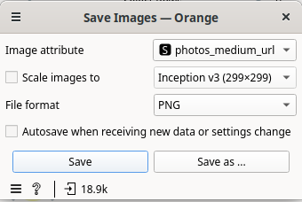

# Presentation

MECODA is a repository to facilitate analyzing and viewing data from diferent citizen science observatories. 

MECODA is constructed on Orange Data Mining, a visual programming toolbox made to simplify analysis and data visualization.

[Orange](orangedatamining.org) supports the construction of data analysis workflows by assembling components for data preprocessing, visualization, and modeling. 

* Learning by doing
* Learning from data by exploring and breaking it and playing with them.

Let's see how orange looks like.

# Installation Guide

1. Install Orange Data Mining platform through https://orangedatamining.com/download 

Click on “Download Orange” or follow the instructions for your operating system (available for Linux, Windows and macOS). Remember to check if you need additional system packages provided by your distribution (like PyQt or PyQtWebEngine), in addition to Orange3.

2. Once installed, open Orange from the menu in your computer, you will see something like this:

3. Go to menu “Options” and select “Add-ons”:

4. In the pop-up click on ***Add more…*** button on the top right. A search window will appear called ***Add add-on by name***. Write ***mecoda-orange*** in the search box and click on the ***Add*** button.

5. ***Mecoda Orange*** will be available in the list of packages for installation. Check the box besides the name.

6. Orange will show a message because it needs to restart. We click on **OK**.

7. We will need other packages for this example, so we check the box of the package called ***Geo*** and ***Image Analytics*** also.

8. After selecting these three packages, we will press **OK** to install them and restart.

9. Orange will be restarted and the interface will show our new installed packages on the left side column:

*WARNING*: If MECODA doesn’t appear in the interface, close it and remove the *.cache/Orange* folder, because other previous installations could be made and have problems with the new one. Check if it is installed in the Options >> Add-ons and if not, install it again.

# Use of Orange Canvas
Main concepts:
* Widgets
* Inputs
* Outputs
* Links: The communication channel passes the output from one widget to the input of the other widget.

Documentation: 
* YouTube tutorials: https://www.youtube.com/channel/UClKKWBe2SCAEyv7ZNGhIe4g
    * Getting started with Orange: https://www.youtube.com/playlist?list=PLmNPvQr9Tf-ZSDLwOzxpvY-HrE0yv-8Fy
* Widget catalog: https://orangedatamining.com/widget-catalog/ 
* Workflows of example: https://orangedatamining.com/workflows/

# Example of Use with Minka widget

* `Minka widget` use and filters. 
* Rename widgets.
* Annotations in the canvas.
* Arrows to point widgets.

## Let’s answer some questions

We are using for this example the widget `Minka` and the project [`Bio-Datathon Athens: trees for life, trees for learning`](https://minka-sdg.org/projects/bio-datathon-athens-trees-for-life-trees-for-learning) (Project ID: 69) 

* **What are the most frequent species of trees in Athens?**

If an observation is well classified, the taxonomic name will be the species. If we cannot reach the species level, we will identify it at the kingdom, phylum, class, order, family, genus level.
    * `Distributions`
    * `Pivot table`

 

 

* **What observations are not identified at least with phylum level** 

Select rows where phylum is defined using `Select rows` widges:
 

Use the link to get data that unmatches the criteria:
 

* **Which are the most active users?**

Use `Pivot table`:

 

You can use also the distribution widget to see the number of observations by user.

* **When are the observations taken?**

Use `Distributions`.

 

* **What is the geographical distribution of the trees in Athens?**

Use `Geo Map`, colored by user, taxonomic rank,... Observations are widely distributed, they are not concentrated in one area.

And explore images from a selection using `Minka images`:

## Create a report with our findings

Use `Report` button to add visualizations to a report and save it in pdf (left bottom side of the widget window).

## Save the dataset of observations and images
Use `Save Data` and `Save Images`:

