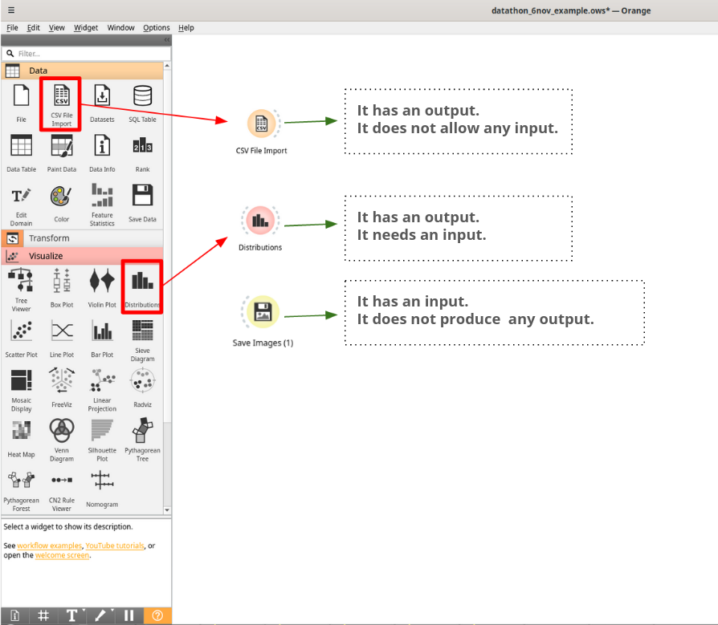
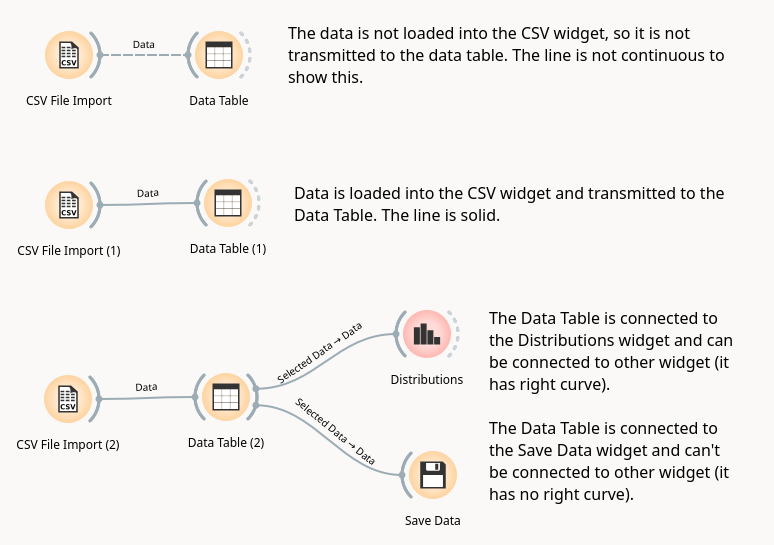
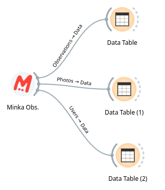
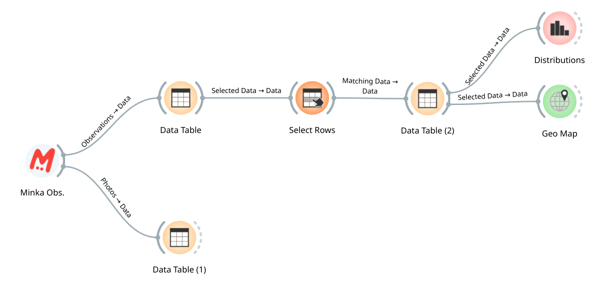

# Inicio de la actividad

Las personas participantes en la Datathon deben seguir la [guía de instalación](guia_instalacion.md) para instalar tanto la aplicación Orange como el paquete mecoda-orange dentro de esa plataforma y los add-ons "Geo" e "Image Analytics".

## La Plataforma de Programación Visual [Orange](https://orangedatamining.com/)

El aspecto de la aplicación es este:

 

1. Columna de widgets.
2. Área de creación del flujo de datos.

En la columna de la izquierda, identificada con el número 1, están los widgets agrupados por tipo:
* **Data**: para importación desde diferentes formatos, ver los datos, ver las estadísticas generales, obtener información del dataset o guardar los datos.
* **Transform**: para seleccionar columnas, filas, transposición, combinación de tablas, agregación, valores únicos, randomización, tablas dinámicas, discretizar valores, etc.
* **Visualize**: incluye diferentes formas de representar gráficamente los datos, como árbol, gráfico de violín, de dispersión, de barras, histogramas, etc.
* **Model, Evaluate, Unsupervised**: herramientas para trabajar modelos de datos, propios de machine learning.

A estos añadiremos los add-ons que nos servirán para realizar nuestro análisis de datos de biodiversidad:
* **MECODA**: widgets que conectan con los datos de diferentes observatorios de Ciencia Ciudadana (Minka, OdourCollect), datos de sensores DIY como CanAIRio, Aire Ciudadano o Smart Citizen.
* **Image Analytics**: incluye widgets para el tratamiento de imágenes, que permite verlas dentro de Orange o utilizar modelos de imágenes para encontrar similitudes.
* **Geo**: para la realización de mapas (de puntos o sombreados) y para la geocodificación de valores de latitude y longitud a regiones administrativas.

NOTA: Puedes consultar toda la información sobre cómo utilizar cada uno de estos widgets en el [catálogo](https://orangedatamining.com/widget-catalog/). 

Los widgets se seleccionan en esta columna izquierda, y aparecen en el área blanca de la derecha (número 2). Para seleccionar el widget basta con clicar una vez sobre él, en la columna de la izquiera.

Cada widget, cada una de estas herramientas disponibles, puede comunicarse con otros widgets de diferentes formas:
* Un widget puede admitir como entrada la salida de otro widget y dar como resultado una salida, que se pueda comunicar con un siguiente widget.
* Puede generar una salida y no admitir ninguna entrada.
* Puede admitir una entrada, pero no dar ninguna salida.

Aquí vemos un ejemplo:

 

En este caso, vemos que hemos seleccionado del menú de la izquiera tres widgets:
* *CSV File Import*, un widget para importar un csv, tiene una línea curva punteada en el lado derecho. Eso quiere decir que este widget puede dar una salida, pero no admite ninguna entrada (el flujo de datos va de izquierda a derecha).
* *Distributions*, un widget para obtener el histograma o distribución de una columna de nuestros datos, tiene línea curva punteada en ambos lados. Es decir, puede recibir información (una tabla de datos) desde el lado izquierdo y puede conectarse con otro widget por el lado derecho.
* *Save Images*, un widget para guardar imágenes en nuestro ordenador. Este widget sólo tiene línea curva en el lado izquierdo. Eso quiere decir que admite entradas, pero realizará el proceso para el que está diseñado (descargar las fotos) y no tendrá ninguna salida en Orange.

Este ejemplo es para explicar solamente cómo se conectan los diferentes widgets, necesario para construir los flujos de datos o data workflows.

Estos widgets se conectarán de esta forma:

 

Aquí vemos que se crea una línea entre los widgets, que comunica la información de unos a otros. Si esta línea no es continua, nos indica que no se está transmitiendo ninguna información de uno a otro, como en este caso. Sobre la línea se indica qué se está transmitiendo: Data (todos los datos) o Selected Data (sólo los datos que hayamos seleccionado en el widget inicial).

# Análisis de un conjunto de datos mayor de 10.000 observaciones de biodiversidad en Minka

## Ejemplo con el área del Ayuntamiento del Prat
Vamos a trabajar con el widget de Minka para obtener las observaciones de biodiversidad registradas en el área de El Prat.

### Seleccionamos los datos a analizar
Seleccionamos el widget de Minka y hacemos doble click sobre el widget para desplegar el cuadro de diálogo. Seleccionamos el área geográfica que comprende la localización del ayuntamiento del Prat, que podemos ver aquí en Minka: https://minka-sdg.org/observations?place_id=246

Dado que ese lugar tiene más de 10.000 observaciones y nuestro límite por descarga es de 10.000 podremos descargar todas las observaciones haciendo dos peticiones, una para las observaciones creadas en 2022 y otra para las de 2023. Cada una de las descargas tardará unos minutos en procesarse, porque se trata de peticiones de un volumen grande de observaciones. Ten paciencia. Si te aparece un mensaje de que el proceso está tardando demasiado, simplemente pincha en "Esperar" y deja que termine. Finalmente obtendrás algo así:

Para descargar los datos haz doble clic el widget de Minka, en el primero elige el place BioPrat y el filtro "Created until:" con la fecha "2022-12-31". Con esto obtendremos las observaciones subidas a la plataforma en 2022. Cuando esta petición termine, abre el segundo widget de Minka y selecciona el place BioPrat y ahora el filtro "Created since:" con la fecha "2023-01-01".

Si la descarga que queremos hacer tiene menos de 10.000 observaciones bastaría con hacer una única descarga con el conjunto del *place* especificado.

Ahora vamos a ver las tablas de datos que hemos obtenido con cada uno. Para ello arrastramos una línea desde el widget de Minka, en la zona donde tiene la línea discontinua. Así podemos "engancharlo" con el widget que nos permitirá ver los datos, llamado "Data Table":

Una vez hayamos pinchado en "Data Table" nos dará la opción de cargar en ese widget dos tipo de datos: "Observations" y "Photos". Esto es porque nuestro widget de Minka tiene dos salidas, una tabla con todas las observaciones y una tabla con todas las fotos. Cada observación puede tener más de una foto. La primera tabla nos permitirá hacer análisis estadístico, la segunda análisis de imágenes:

Seleccionamos coger las observaciones (Observations -> Data) y eso cargará las observaciones en la Tabla. Le damos a OK y veremos esto al hacer doble click en "Data Table":

Son nuestros datos de observaciones en una tabla, con todos nuestros campos. Ahora hagamos lo mismo con las fotos, saquémoslas a otra tabla. Y repitamos el proceso con el segundo widget de MINKA donde tenemos las observaciones de 2023:

Ya tenemos todos los datos extraidos. Vemos que la conexión de cada una de las dos líneas de Minka a Data Table es distinta y nos indica que en una está llevando "Observations" hacia los datos de la tabla y en el otro caso está llevando "Photos" hacia los datos de la segunda tabla.

Ahora vamos a unir las tablas de observaciones en una sola tabla para analizarla. Para eso seleccionaremos el widget "Concatenate" que está en la sección "Transform" de la columna de la izquierda. Hacemos click sobre él y se colocará en nuestra área de trabajo. 

Vamos a pasar por ese widget nuestra dos tablas de observaciones. Sacamos una línea desde la primera hacia "Concatenate". Nos creará una conexión por defecto, pero la vamos a editar haciendo click sobre la línea que comunica los dos widgets:

Quitaremos la conexión de "Selected Data" a "Additional Data" pinchando sobre la línea:

Comunicaremos "Data" con "Primary Data", porque queremos que considere todo el conjunto de nuestros datos como los datos primarios a la hora de concatenarlos. Nos quedará algo así:

Pinchamos en OK.

Ahora hacemos lo mismo con la segunda tabla de observaciones, la conectaremos con Concatenate. En este caso no editaremos la conexión, porque estos sí serán el "Additional Data" que queremos unir al primero. Sacamos una tabla ahora con el conjunto de los datos y vemos que el resultado ya tiene más de 12.300 observaciones (es la unión de ambas tablas). Ya podemos trabajar con él:

## Selección de las observaciones con grado de investigación
Lo primero que haremos será quedarnos con aquellas observaciones que hayan alcanzado el grado de investigación (tengan al menos 2 identificaciones y estén de acuerdo en la especie y no le falta ningún dato de los considerados obligatorios). Para eso vamos a conectar nuestra tabla con todas las observaciones con el widget "Select Rows", del bloque "Transform":

Con este widget podremos seleccionar las líneas que queramos simplemente indicando cuál es la condición o condiciones que deben cumplir. En este caso queremos las observaciones que tengan, en la columna "quality_grade" el valor "research":

Podemos añadir más de una condición simplemente pinchando en "Add Condition". Una vez establecida nuestra condición podemos ver en la parte de abajo del widget cuál es el resultado de aplicarlo. De las 12.3k observaciones totales está seleccionando 10.6k y descartando 1722. Es decir, en nuestro conjunto de datos teníamos 1722 observaciones que, o bien necesitaban identificación, o bien carecían de algún dato de los considerados obligatorios para alcanzar el nivel de investigación (localización, foto, etc).

Si sacamos una tabla con las observaciones resultantes de "Select Row" veremos las que sí cumplen nuestra condición.

## Distribución de nuestros datos

Digamos que queremos saber es cuántas observaciones se han registrado cada mes. Para eso conectaremos nuestra tabla resultante con el widget "Distributions", de la sección "Visualize". Haciendo doble click sobre ese widget, después de haberlo conectado, veremos algo así:

 

Aquí podremos jugar con varios parámetros. El primero es la columna que queremos analizar. En este caso seleccionaremos "created_at" (para analizar por fecha de subida de la observación) o "observed_on" (para analizar por fecha en la que se ha tomado la observación). 

Lo segundo que haremos será seleccionar el periodo temporal que queremos que se use para agrupar los datos (1 mes, 1 año,...). Ahí nos dará más o menos columnas. Si el rango de los datos es muy amplio, nos permitirá crear agrupaciones amplias (año). Si el rango es pequeño nos permitirá bajar a nivel de día o de horas.

Lo tercero que podemos hacer es dividir nuestra columnas según algún criterio, por ejemplo, el reino al que pertenecen, el usuario que las ha subido, etc. Si elegimos un campo con muchas opciones la división por colores de las columnas las hará difícil de leer.

Podemos guardar el gráfico que nos interese simplemente pinchando en el icono de "disquete" de la parte inferior izquierda del widget "Distribution".

Podemos usar este widget también para ver la distribución en otras columnas, como la de "user login", que nos agruparía las observaciones por nombre de usuario que las ha reportado.

## Mapeo de las observaciones

Ahora conectaremos nuestra tabla de datos con el widget "Geo Map", de la sección "Geo" de la columna izquierda:

 

Haciendo doble click sobre él veremos qué opciones tenemos para trabajar los datos a un nivel geográfico:

 

Lo primero en lo que debemos fijarnos es que la latitud y longitud han sido leídas correctamente en nuestra tabla de datos. En este caso, como le hemos dado a esas columnas el nombre exacto, el widget ha sabido dónde encontrar los datos. Pero si usamos otro conjunto de datos podríamos tener que indicarle manualmente cuáles son esas columnas.

Encima de los datos de lat-lon tenemos el tipo de mapa en el que visualizar nuestras observaciones. Por defecto, se abrirá en Open Street Map, pero podemos cambiar la visualización a Satellite.

Vemos que podemos usar atributos como el color de los puntos para ver los datos de nuestra tabla. Podríamos elegir que el color de los puntos estuviera en función del usuario (columna user_login), de la clase taxonómica (columna class), etc. 

Si queremos interectuar con el mapa tenemos tres botones en la sección Zoom/Select:
- Flecha: nos permite seleccionar áreas del mapa
- Mano: nos permite desplazar el mapa
- Lupa: nos permite hacer zoom

Podemos extraer el mapa resultante como una imagen usando el botón de "disquete" de la parte inferior.

Y podemos usar el mapa como filtro para seleccionar observaciones y extraer una nueva tabla con las seleccionadas.

## Estadísticas de nuestros datos

Digamos que ahora queremos analizar cuántos usuarios han aportado datos en el área que estamos analizando, la media de observaciones por usuario, la mediana, etc. En nuestro conjunto de datos tenemos la columna "user_login", que nos da el nombre, pero no tenemos el número de observaciones de cada usuario en ninguna tabla. Vamos a crear esta tabla numérica. 

Los pasos a seguir son:
* Conectar nuestra tabla de datos con "Select column" para quedarnos únicamente con la columna que nos interesa:

 

* Conectar la columna seleccionada con "Group by", que nos permitirá agrupar los usuarios y sacar el número de cada uno:

 

* Conectar el resultado de Group by con una tabla para ver qué tenemos:

 

* Conectar la tabla con Feature Statistics para obtener las estadísticas (media, mediana, moda,...) de nuestro resultado:

 

Podemos hacer el mismo proceso usando la columna de "taxon name" y sacar el número de observaciones de cada especie:

 

Incluso saber cuándo ha sido la primera vez que se ha reportado una especie, indicando que incluya el dato del valor mínimo de la columna "observed_on" que tiene las fechas:

 

## Relación entre variables

Si queremos ver la relación entre dos columnas, podemos utilizar Pivot Table, que es similar a la tabla dinámica en Excel. Nos permite crear una tabla con el número de observaciones agrupadas por dos de las columnas, por ejemplo, entre los grupos taxonómicos y los usuarios:

Aquí podemos ver si los distintos usuarios se especializan en un grupo taxonómico o sus observaciones son diversas.

## Reconocimiento en el uso de los datos

Si vais a utilizar este conjunto de datos para alguna publicación o investigación, deberéis reconocer la contribución de aquellos usuarios y usuarias que hayas hecho aportaciones a él. Para facilitar el trabajo a la hora de citarlos podéis usar el widget "Minka Mentions", simplemente conectándolo con nuestra tabla con el conjunto de los datos y mostrando su salida en un Data Table:

Obtenemos una tabla con el nombre de los usuarios, el enlace a su perfil, donde tenemos el resto de sus datos de usuario que han querido hacer públicos, y el número de observaciones con las que han contribuido. 

## Guardar nuestro conjunto de datos

Para guardar en nuestro ordenador el conjunto el widget "Save Data" y lo abrimos. Desmarcamos la opción "Add type annotations to header". 

Al pinchar en "Save As" nos dará la opción de guardarlo en cualquier formato de tabla habitual (xlsx, csv, tab). Así podremos guardarnos la descarga con los datos actualizados a fecha de hoy.

## Exploración de las imágenes

Hemos estado analizando los datos que teníamos en nuestra tabla de observaciones. Pero el widget de Minka nos dio dos tablas con resultados: la de observaciones y otra con las fotos. La tabla de fotos tendrá este aspecto:

Uno de los campos es la url de la imagen, y eso nos permite verlas dentro de Orange, conectado esa tabla al widget "Image viewer" de la sección de "Image Analytics" y ver algo así:

Aquí podemos modificar el título que nos aparece debajo de cada imagen, por cualquiera de los campos que tenemos en nuestra tabla, explorar todo el conjunto de imágenes. O también hacer una selección conectando la tabla a "Select Rows" y seleccionar solo las de una taxonomía (columna taxon_name) y ver las imágenes de esa taxonomía.

O podemos seleccionar todas aquellas que no están identificadas, para intentar hacerlo de un vistazo rápido, usando "Select Rows" y la condición *"taxon_name" is not defined*. Así podemos ver si podemos identificar alguna de las imágenes. Simplemente la seleccionamos, sacamos una tabla, y tenemos la url de la observación en Minka para acceder a ella e identificarla.

## Guardar nuestro workflow para volver a ejecutarlo

El árbol de procesos que hemos creado en Orange se puede guardar en el formato nativo de Orange (.ows). De esta forma podemo volver a abrirlo y reproducir el proceso. Para guardar un workflow simplemente nos vamos al menú superior de Orange, dentro de File y pinchamos en Save As:

El workflow resultante de este ejercicio lo podéis encontrar [aquí](workflows/datathon_6nov_bioprat.ows) y descargarlo para abrirlo dentro de vuestro Orange.

Otros ejemplos de workflows:
* [Parc Natural Cap de Creus](workflows/datathon_6nov_cap_creus.ows)