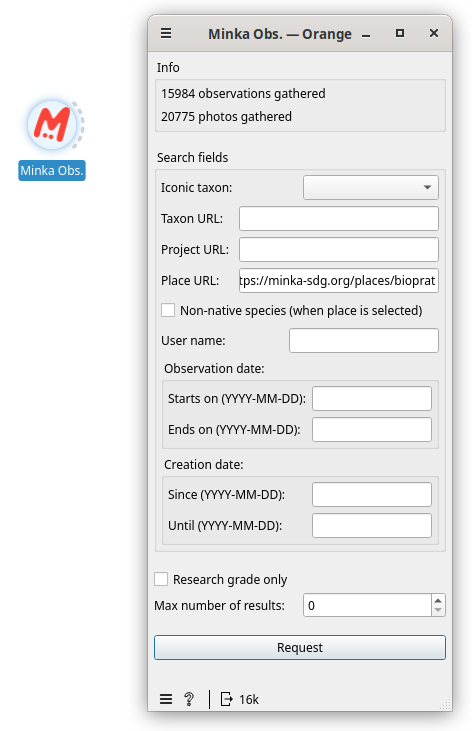
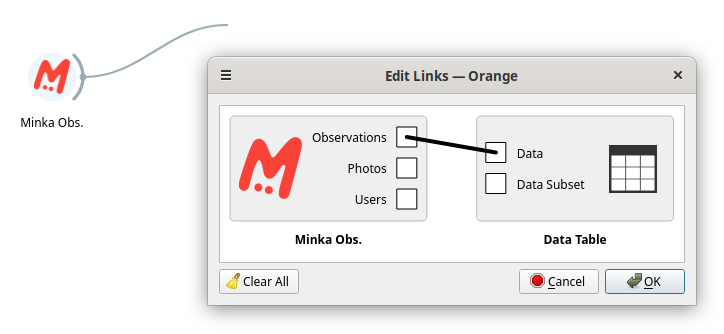
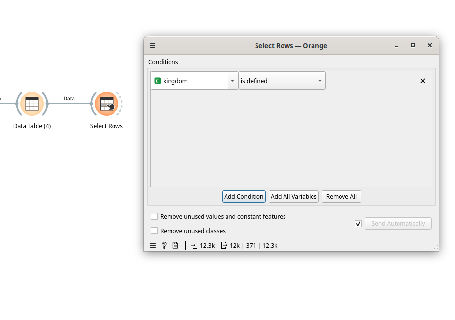

# DATATHON: Data analysis with biodiversity data from the Minka citizen science observatory

Participants in the Datathon must follow the [installation guide](https://github.com/eosc-cos4cloud/mecoda-orange/blob/master/docs/english/installation_guide.md) to install both the Orange application and the mecoda-orange package within that platform. Also, the "Geo" and "Image Analytics" add-ons are required.

## The [Orange](https://orangedatamining.com/) Platform 

The application looks like this:

1. Column widgets.
2. Dataflow creation area.

In the left column, identified with the number 1, are the widgets grouped by type:

* **Data**: to import from different formats, view the data, view general statistics, obtain dataset information or save the data.

* **Transform**: to select columns, rows, transpose, join tables, aggregation, unique values, randomization, pivot tables, discretize values, etc.

* **Visualize**: includes different ways to graphically represent data, such as a tree, violin plot, scatter plot, bar plot, histograms, etc.

* **Model, Evaluate, Unsupervised**: tools to work with data models, typical of machine learning.

To these, we will add the add-ons that will help us carry out our biodiversity data analysis:

* **MECODA**: widgets that connect with data from different Citizen Science observatories (Minka, OdourCollect), and data from DIY sensors such as CanAIRio, Aire Ciudadano or Smart Citizen.

* **Image Analytics**: includes widgets for image processing, allowing you to view them within Orange or use image models to find similarities.

* **Geo**: for creating maps (point or shaded) and for geocoding latitude and longitude values to administrative regions.

NOTE: You can consult all the information on how to use each of these widgets in the [catalogue](https://orangedatamining.com/widget-catalog/).

Widgets are selected in this left column and appear in the white area on the right (number 2). To select the widget, just click on it once, in the left column.

Each widget, each of these available tools, can communicate with other widgets in different ways:
* A widget can take as input the output of another widget and result in an output, which can communicate with the following widget.
* It can generate one output and accept no input.
* It can admit an input, but not give any output.

Here we see an example:

In this case, we see that we have selected three widgets from the left menu:

* *CSV File Import*, a widget for importing a CSV, has a dotted curved line on the right side. That means that this widget can give an output, but it does not accept any input (the data flow goes from left to right).

* *Distributions*, a widget to obtain the histogram or distribution of a column of our data, has a dotted curved line on both sides. That is, it can receive information (a data table) from the left side and can connect to another widget on the right side.

* *Save Images*, a widget to save images on our computer. This widget only has a curved line on the left side. That means that it accepts input, but it will carry out the process it is designed for (downloading the photos) and will not have any output in Orange.

This example is only to explain how the different widgets are connected, necessary to build data flows or data workflows.

These widgets will be connected like this:

Here we see that a line is created between the widgets, which communicates information from one to another. If this line is not continuous, it indicates that no information is being transmitted from one to the other, as in this case. Above the line it is indicated what is being transmitted: Data (all the data) or Selected Data (only the data that we have selected in the initial widget).

# Analysis of a data set larger than 10,000 biodiversity observations in Minka

## Example with the El Prat area
We are going to work with the Minka widget to obtain the biodiversity observations recorded in the El Prat area.

### **Extract data to analyze**
We select the Minka widget and double-click on the widget to display the dialogue box. We select the geographical area that includes the location of El Prat city, which we can see here in Minka: [https://minka-sdg.org/places/bioprat](https://minka-sdg.org/places/bioprat)

The downloads will take a few minutes to process, because these are requests for a large volume of observations. Be patient. If you see a message that the process is taking too long, simply click "Wait" and let it finish. Finally, you will get something like this:

To download the data, double-click the Minka widget and choose the BioPrat place (ID: 246). 

After finishing the process, now we are going to see the data tables that we have obtained. To do this, we drag a line from the Minka widget, in the area where it has the dashed line. So we can "hook" it with the widget that will allow us to see the data, called "Data Table":

Once we have clicked on "Data Table" it will give us the option to load two types of data into that widget: "Observations" and "Photos". This is because our Minka widget has two outputs, a table with all observations and a table with all photos. Each observation can have more than one photo. The first table will allow us to do statistical analysis, the second image analysis:

We select to take the observations (Observations -> Data) and that will load the observations into the Table. We click OK and we will see this by double clicking on "Data Table":

It's our observations data in a table, with all our fields. Now let's do the same with the photos, let's take them to another table. 

We already have all the data extracted. We see that the connection of each of the three lines from Minka to the Data Table is different and tells us that in one it is taking "Observations" to the data in the table, in the other case it is taking "Photos" to the data in the table. a second table and the other taking “Users” to the data in the table, a third table.

## Selection of research-grade observations
The first thing we will do is keep those observations that have reached the level of research (they have at least 2 identifications and agree on the species and do not lack any data considered mandatory). For that, we are going to connect our table with all the observations with the "Select Rows" widget, from the "Transform" block:

With this widget, we can select the lines we want simply by indicating the condition or conditions that must be met. In this case, we want the observations that have, in the "quality_grade" column, the value "research":

We can add more than one condition simply by clicking on "Add Condition". Once our condition is established we can see at the bottom of the widget what the result of applying it is. Of the 12.3k total observations, it is selecting 10.6k and discarding 1722. That is, in our data set we had 1722 observations that either needed identification or lacked any data considered mandatory to reach the research level (location, photo, etc).

If we draw a table with the observations resulting from "Select Row" we will see those that do meet our condition.

## Distribution of our data

Let's say we want to know how many observations have been recorded each month. For that, we will connect our resulting table with the "Distributions" widget, from the "Visualize" section. By double-clicking on that widget, after having connected it, we will see something like this:

Here we can play with various parameters. The first is the column we want to analyze. In this case, we will select "created_at" (to analyze by the date the observation was uploaded) or "observed_on" (to analyze by the date the observation was taken).

The second thing we will do is select the period that we want to be used to group the data (1 month, 1 year,...). There it will give us more or fewer columns. If the range of the data is very wide, it will allow us to create broad groupings (year). If the range is small, it will allow us to go down to the day or hour level.

The third thing we can do is divide our columns according to some criteria, for example, the realm to which they belong, the user who uploaded them, etc. If we choose a field with many options, the colour division of the columns will make them difficult to read.

We can save the graph that interests us simply by clicking on the "floppy disk" icon at the bottom left of the "Distribution" widget.

We can also use this widget to see the distribution in other columns, such as "user login", which would group the observations by the name of the user who reported them.

## Mapping of observations

Now we will connect our data table with the "Geo Map" widget, from the "Geo" section of the left column:

By double-clicking on it we will see what options we have to work with the data at a geographic level:

The first thing we should look at is that the latitude and longitude have been read correctly in our data table. In this case, since we have given those columns the exact name, the widget knows where to find the data. But if we use another data set we might have to manually tell it what those columns are.

Above the lat-lon data, we have the type of map on which to visualize our observations. By default, it will open in Open Street Map, but we can change the display to Satellite.

We see that we can use attributes such as the colour of the points to view the data in our table. We could choose that the colour of the points was based on the user (user_login column), the taxonomic class (class column), etc.

If we want to interact with the map we have three buttons in the Zoom/Select section:
- Arrow: allows us to select areas of the map
- Hand: allows us to move the map
- Magnifying glass: allows us to zoom

We can extract the resulting map as an image using the "floppy" button at the bottom.

We can use the map as a filter to select observations and extract a new table with the selected ones.

## Statistics of our data

Let's say that now we want to analyze how many users have contributed data in the area we are analyzing, the average number of observations per user, the median, etc. In our data set, we have the column "user_login", which gives us the name, but we do not have the number of observations for each user in any table. Let's create this number table.

The steps to follow are:
* Connect our data table with "Select column" to only have the column that interests us:

* Connect the selected column with "Group by", which will allow us to group the users and get the number of each one:

* Connect the result of the "Group by" with a table to see what we have:

* Connect the table with Feature Statistics to obtain the statistics (mean, median, mode,...) of our result:

We can do the same process using the "taxon name" column and get the number of observations for each species:

Even now when the first time a species has been reported, indicating that it includes the minimum value data of the "observed_on" column that has the dates:

## Relationship between variables

If we want to see the relationship between two columns, we can use a Pivot Table, which is similar to the pivot table in Excel. It allows us to create a table with the number of observations grouped by two of the columns, for example, between taxonomic groups and users:

Here we can see if different users specialize in a taxonomic group or if their observations are diverse.

## Recognition in the use of data

If you are going to use this data set for any publication or research, you must recognize the contribution of those users who have contributed to it. To make your work easier when citing them, you can use the "Minka Mentions" widget, simply connecting it to our table with the set of data and showing its output in a Data Table:

We obtain a table with the name of the users, the link to their profile, where we have the rest of their user data that they have wanted to make public, and the number of observations with which they have contributed.

## Save our data set

To save on our computer, set the "Save Data" widget and open it. We uncheck the "Add type annotations to header" option.

Clicking on "Save As" will give us the option to save it in any common table format (xlsx, CSV, tab). This way we can save the download with the data updated as of today.

## Image Browsing

We have been analyzing the data we had in our observations table. But the Minka widget gave us two tables with results: one with observations and another with photos. The photo table will look like this:

One of the fields is the URL of the image, and that allows us to see them within Orange, connecting that table to the "Image viewer" widget in the "Image Analytics" section and seeing something like this:

Be sure that the column in the field Image Filename Attribute is "photos_medium_url". This column includes the link to the photos and has to be selected to see the images in the Image Viewer widget. Here we can modify the title that appears below each image, for any of the fields that we have in our table, and explore the entire set of images. Or also make a selection by connecting the table to "Select Rows" and select only those of a taxonomy (taxon_name column) and see the images of that taxonomy.

Or we can select all those that are not identified, to try to do it at a glance, using "Select Rows" and the condition *"taxon_name" is not defined*. This way we can see if we can identify any of the images. We simply select it, extract a table, and have the URL of the observation in Minka to access it and identify it.

## Save our workflow to run it again

The process tree we have created in Orange can be saved in the native Orange format (.ows). This way we can reopen it and reproduce the process. To save a workflow we simply go to the top menu of Orange, within File and click on Save As:

You can find the workflow resulting from this exercise [here](workflows/datathon_6nov_bioprat.ows) and download it to open it within your Orange.

Other examples of workflows (remember to open it using Orange):
* [Cap de Creus Natural Park](workflows/datathon_6nov_cap_creus.ows)
