# Generic example of Orange operation (estimated time: 30min)

We will use Orange's own widgets to get familiar with the application.

We are going to download one of the existing Orange datasets to perform a simple analysis. To do this, we select the "Datasets" widget from the "Data" section, in the left column where all the available widgets are located.

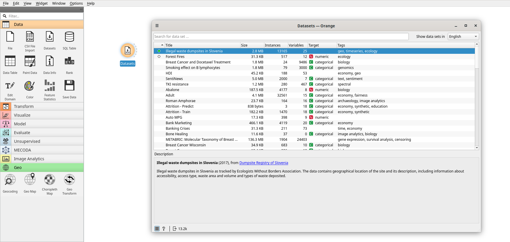

We double click on the widget to open the window that will allow us to select a dataset that Orange has loaded to practice. In this case we choose the data set "Illegal waste
dumpsites in Slovenia", by double clicking on it to download it to our application. A green circle will appear next to the name of the dataset when it has been downloaded.

Let's explore the data we have obtained. To do this we use the *Data Table* widget, connecting it with our *Datasets* widget. We see that the connection between the two widgets is a solid line, indicating that the data has been transmitted successfully. By double clicking on Data Table we see the data we have:

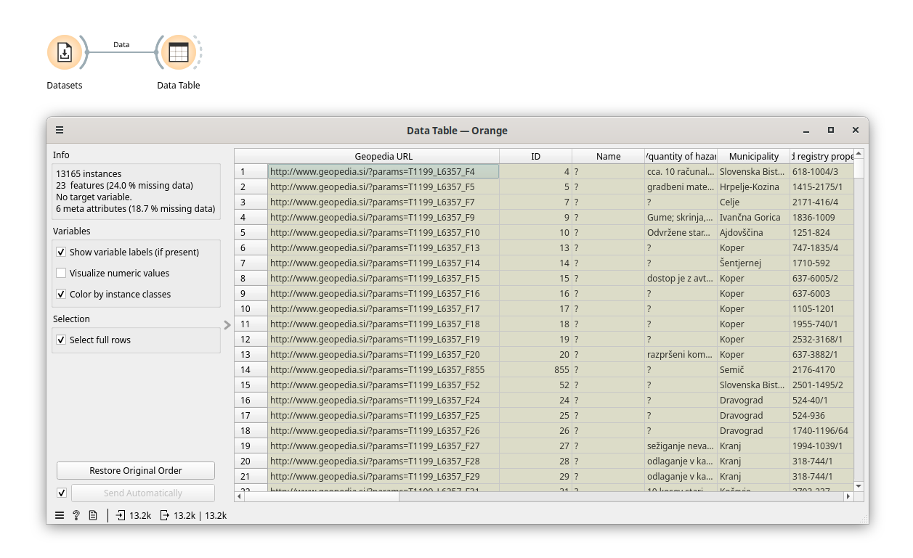

We see that it is 13165 lines (instances). We explore the columns we have to get an idea of the data. We can now analyze them.

## How many incidents have been recorded each year?
There is a field called "Entry creation date" that gives us the date the record was entered. We will take this as the date of the violation. We want to see how many registrations there are each year. We will connect our table with the widget that allows us to view distributions, called *Distributions* and we double click on it to see what options it gives us:

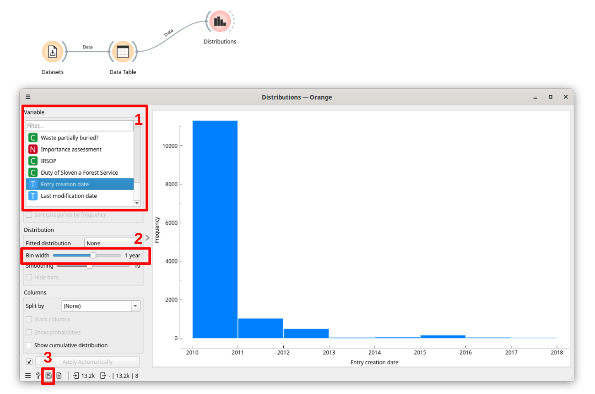

The first thing is to select the variable (the column) that we want to represent. From the list of column names marked with the number 1, we select *Entry creation date*. We will see a representation of the data in dates. The field with the number 2, called *Bin width*. Here we can decide what time range we want for our grouping. We will choose *1 year*, to get the distribution year by year.

Now we see a column graph with the number of records we have each year, and the number of events we have from 2010 is striking. Let's think that we want to download this first graph. We go to the lower left part of the window and we will see a small floppy disk (identified with the number 3). By clicking on it we can download the image of the graph.

But we can do something else with our distribution graph. We may want to split the records of each column by another variable:

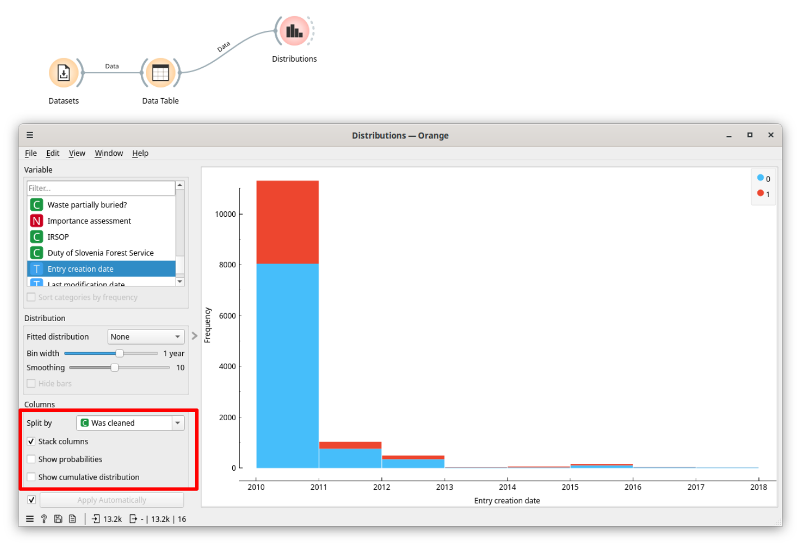

In this case we have a column called *Was cleaned* that tells us if the spill has been cleaned or not. Let's use it to see how many of each year's records have been cleaned. We select the name of the column in the *Split by* field. It will show us two columns for each year, one for the records that have a value of 0 in *Was cleaned* and another with those that have a value of 1. In general, 0 is considered equivalent to False and 1 to True. This two-column-per-year view can be a little confusing to parse. If we prefer that both appear in stacked columns, we will select *Stack columns*, below the drop-down menu where we have chosen the column. We will be left with a very illustrative graph.

# Change values of a column

Let's say that the fact that the *Was cleaned* column has values 0 and 1 is not very clear and we want it to return False/True instead, to help us interpret the results. We can do this using the *Edit Domain* widget:

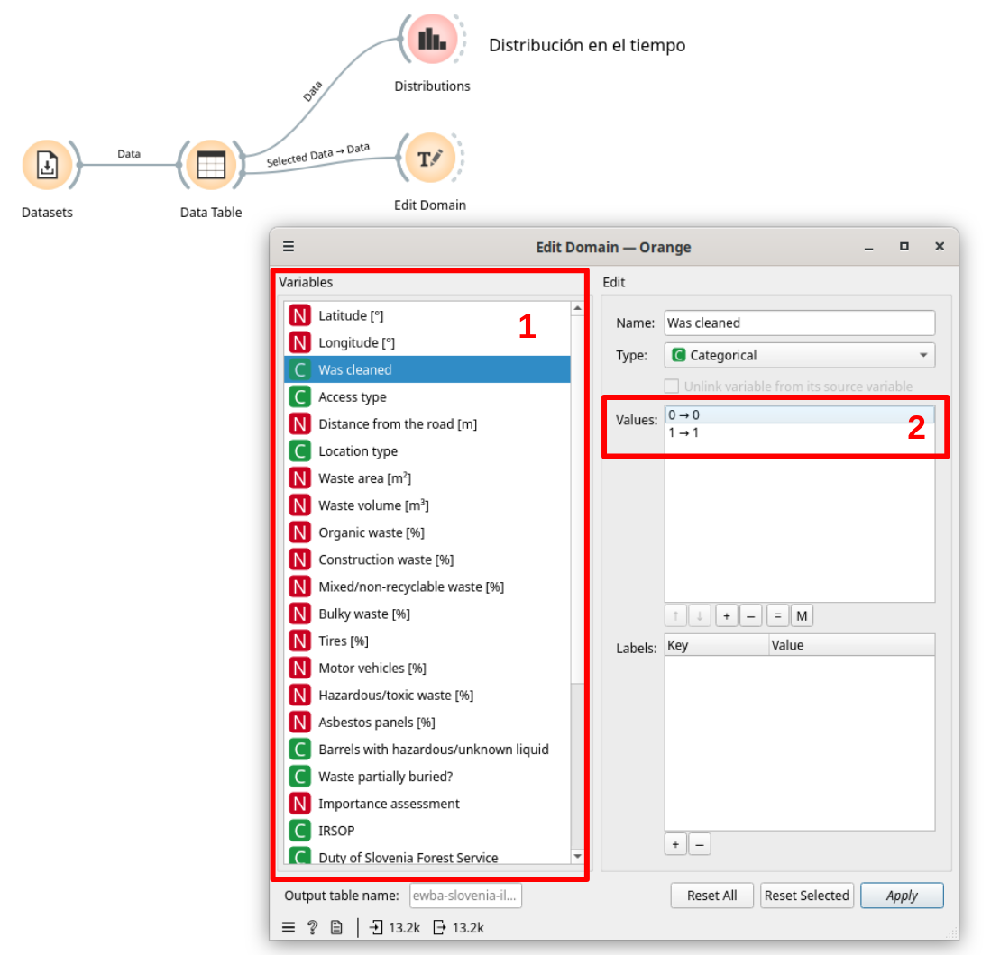

There we select the column we want to treat, in the section marked with a 1. We see the values that the *Was cleaned* column can take, which can be 0 or 1. If we double click on 0 we can give it the value we want it to have , for example, "NO" for 0, and "YES" for 1. After typing the value we want it to take, press Enter to make the change. We will see something like this:

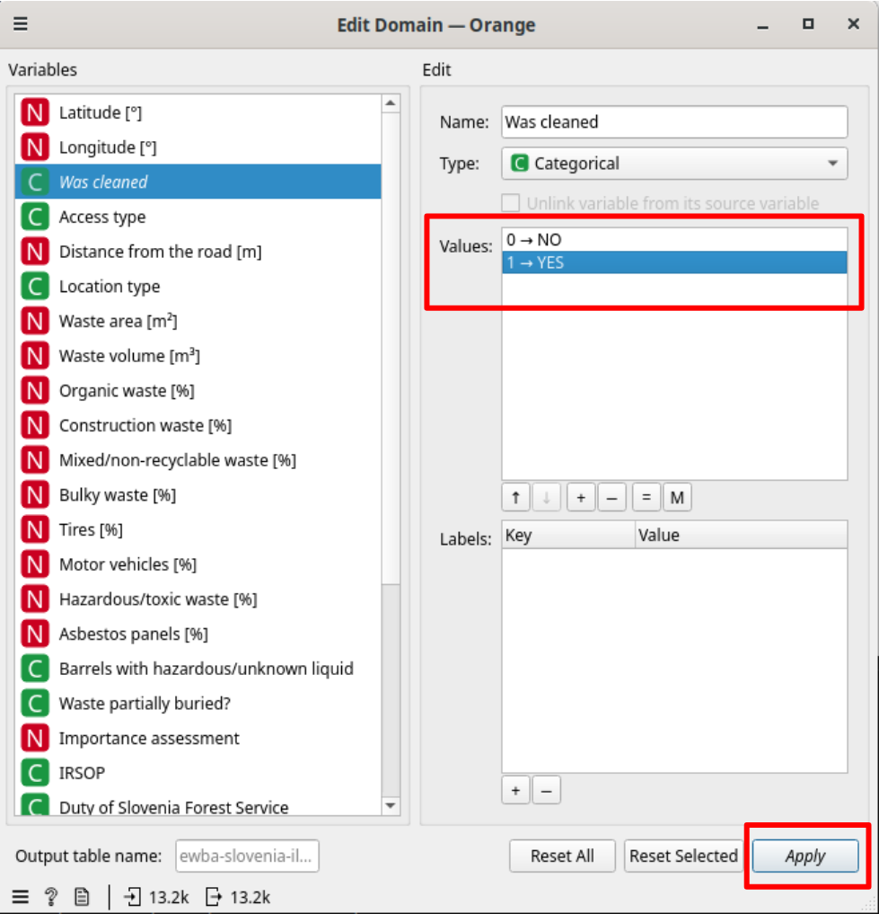

We can now use this output to correctly represent this data.

# Create a column from other data
Let's go back to the original dataset. There is a column called *Waste area (m2)* that is very interesting for our analysis, but we would like to obtain from it the records that correspond to small, large and very large areas.

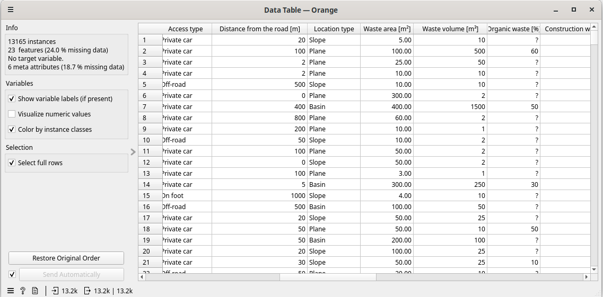

Let's try that numerical column. We use the *Discretize* widget found in the *Transform* section. We open that widget, choose the column we want to convert and then the transformation form. In this case we will directly choose the ranges we want for our column (Custom option) and these will be: 100m2, 1000m2 and 10000m2:

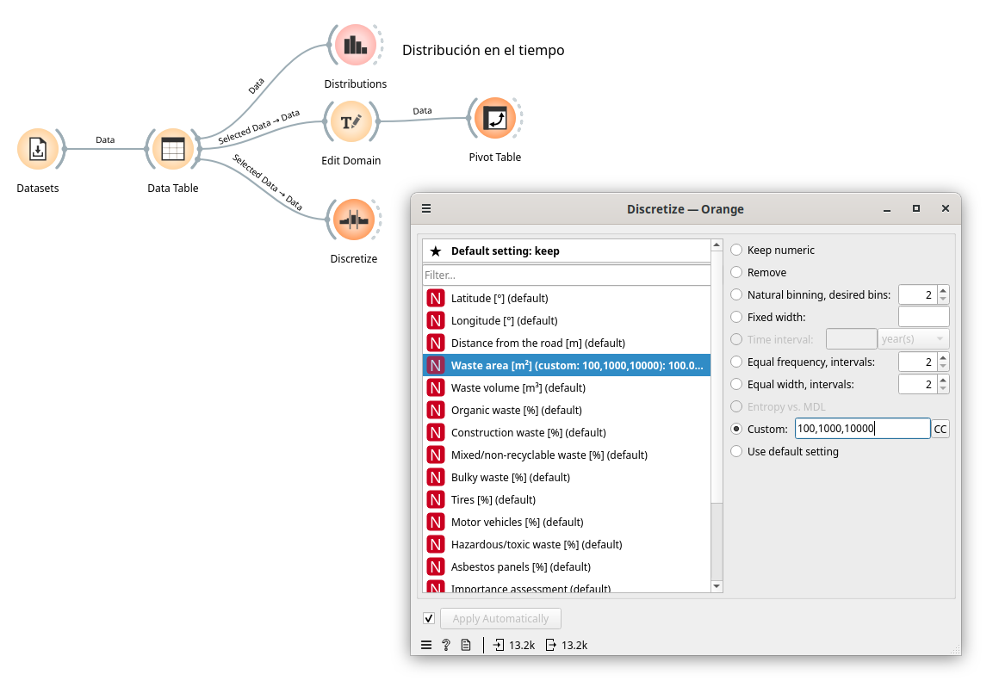

How does our table look after doing this?

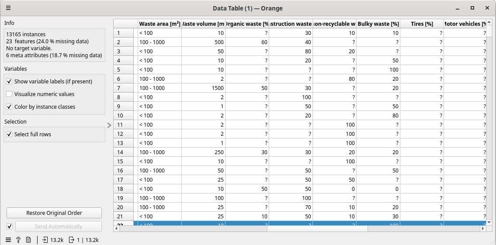

We see that we now have a column in which the range of the garbage area appears, according to the parameters that we gave it: less than 100m2, between 100 and 1000m2, between 1000-10000 and more than 10000. We can now see the number of records of each rank. We just have to connect our new table with the *Distribution* widget, as we did before, to see the number of records in each strip.

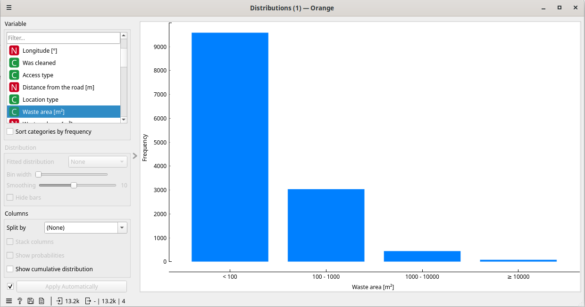

# Represent the records on a map
We are going to see one of the most interesting data representation options when we have locations. Let's see its representation on a map. We connect our data table to the *Geo Map* widget. What we will see will be something like this:

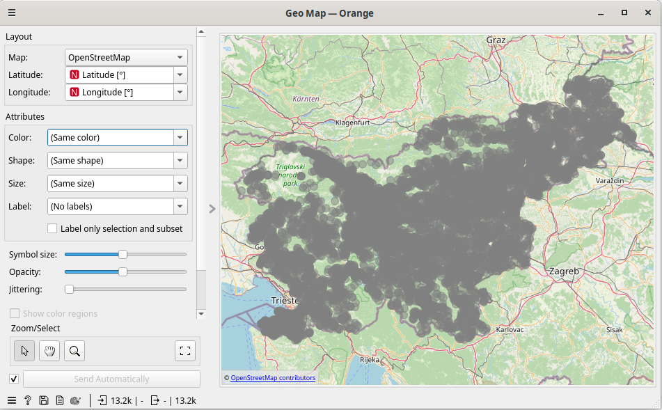

By modifying the attributes, we can create a map that communicates information. We can choose the color of the points according to a column, such as *Was cleaned*, *Waste partially buried?* or any category type. We can size it based on a numerical column, such as *Waste area [m2]* or *Waste volume [m3]*. We can save the map in the same way that we save a graph, or make a selection of an area to keep those records and be able to analyze them separately.

The result of all this is a workflow that we can save in its own .ows format and reproduce at any time.

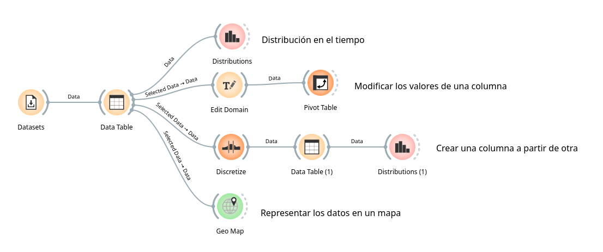