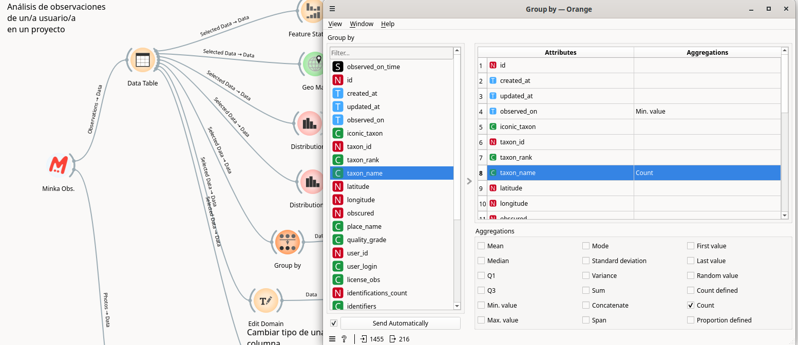

# Workshop for MINKA users with BioMARató 2024 data

## Orange installation:

1. Install Orange Data Mining via https://orangedatamining.com/download

Download the appropriate version for your operating system (Windows or macOS). If you have any Linux distribution, follow the steps to install Orange using [Anaconda](https://www.anaconda.com/download) or pip (if you have it installed).

2. Once installed (it takes about 15 min and it may ask you to also install Miniconda in the process), open Orange from your computer's menu or from the link on the desktop. You will see something like this:

 

* Installing the required add-ons: `mecoda-orange`, `Image Analytics` and `Geo`.

Go to the "Options" menu in the top menu bar and select "Add-ons":

In the pop-up that opens, click on "Add more...", in the top right corner. A search window will appear called "Add add-on by name". Type "mecoda-orange" in the search bar and click "Add".

***Mecoda Orange*** will appear available in the list of installation packages, last. Check the box next to the name and click OK to install it. If the process is successful, Orange will ask you to restart it when it is finished.

We will need other packages for our exercise, so after installing MECODA we go to "Options" > "Add-ons" again and select the ***Geo*** and ***Image Analytics*** packages from the list.

After selecting these two packages, we click on **OK** to install them. Orange will ask us to restart again.

Orange will restart and the interface will show our installed packages in the left column:

## Exploring the Orange interface.

The application looks like this:

1. Widget column.
2. Data flow creation area.

In the left column, identified with the number 1, are the widgets grouped by type:
* **Data**: for importing from different formats, viewing data, viewing general statistics, obtaining information from the dataset or saving data.
* **Transform**: for selecting columns, rows, transposition, table combination, aggregation, unique values, randomization, pivot tables, discretizing values, etc.
* **Visualize**: includes different ways of graphically representing data, such as tree, violin chart, scatter plot, bar chart, histograms, etc.
* **Model, Evaluate, Unsupervised**: tools for working with data models, specific to machine learning.

To these we will add the add-ons that will help us perform our biodiversity data analysis:
* **MECODA**: widgets that connect to data from different Citizen Science observatories (Minka, OdourCollect), data from DIY sensors such as CanAIRio, Aire Ciudadano or Smart Citizen.
* **Image Analytics**: includes widgets for image processing, which allows you to view them within Orange or use image models to find similarities.
* **Geo**: for creating maps (point or shaded) and for geocoding latitude and longitude values ​​to administrative regions.

NOTE: You can consult all the information on how to use each of these widgets in the [catalog](https://orangedatamining.com/widget-catalog/).

The widgets are selected in this left column, and appear in the white area on the right (number 2). To select the widget, simply click once on it in the left column.

Each widget, each of these available tools, can communicate with other widgets in different ways:
* A widget can accept as input the output of another widget and produce as a result an output, which can communicate with a following widget.
* It can generate an output and not accept any input.
* It can accept an input, but not give any output.

Here is an example:

In this case, we see that we have selected three widgets from the left menu:
* *CSV File Import*, a widget to import a csv, has a dotted curved line on the right side. That means that this widget can give an output, but it does not accept any input (the data flow goes from left to right).
* *Distributions*, a widget to get the histogram or distribution of a column of our data, has a dotted curved line on both sides. That is, it can receive information (a data table) from the left side and can connect to another widget on the right side.
* *Save Images*, a widget to save images to our computer. This widget only has a curved line on the left side. This means that it accepts inputs, but it will perform the process it is designed for (downloading the photos) and will not have any output in Orange.

This example is only to explain how the different widgets are connected, which is necessary to build the data flows or data workflows.

These widgets will be connected in this way:

Here we see that a line is created between the widgets, which communicates the information from one to the other. If this line is not continuous, it indicates that no information is being transmitted from one to the other, as in this case. Above the line is indicated what is being transmitted: Data (all data) or Selected Data (only the data that we have selected in the initial widget).

# Analysis of BioMARató user data

## Analysis of user data

The first thing we will do is access the data of each user in MINKA within the BioMARató 2024 project.

We will use the MINKA widget and the following filters:
- Project URL: https://minka-sdg.org/projects/biomarato-2024-catalunya
- User name: <yournameinminka>

The result will be this:

At the top it will indicate the data that has been downloaded from MINKA: a number of observations and a number of photographs.
As you know, in MINKA an observation can include more than one photo, so it is normal for there to be more photographs than observations.

This widget has a dotted area on the right side. This indicates that it has an output and that output can be connected to other widgets.

We drag a line from that dotted area and release it so that it gives us the option to choose which widget we want to connect to it.

This way we can "connect" it to the widget that will allow us to see the data, called "Data Table":

Once we have clicked on "Data Table" it will give us the option to load three types of data into that widget: "Observations", "Photos", "Users". This is because our Minka widget has three outputs, a table with all the observations and a table with all the photos and a table with the users who have participated as observers or identifiers in these observations (in order to cite them if the data is used).

The first table will allow us to do statistical analysis:

We select to take observations (Observations -> Data) and that will load the observations into the Table. We click OK and we will see this when we double-click on "Data Table":

This is our observation data in a table, with all our fields. Now let's do the same with the photos, let's take them to another table. And let's repeat the process with the second MINKA widget where we have the observations from 2023:

Now we have all the data extracted. We see that the connection of each of the two lines from Minka to Data Table is different and indicates that in one it is carrying "Observations" to the data of the table and in the other case it is carrying "Photos" to the data of the second table.

## Viewing statistics for your data

We will connect the table with the observations with the "Feature Statistics" widget:

There we will be able to see the main metrics in our data. Missing values, mean, mode, dispersion, etc. It is a good way to get a first impression of the data we are working with.

## Geographic exploration

Now we will connect our data table with the "Geo Map" widget, from the "Geo" section of the left column, or by typing the name when we drop the connecting line:

The first thing we should notice is that the latitude and longitude have been read correctly in our data table. In this case, since we've given those columns the exact name, the widget has known where to find the data. But if we used another dataset we might have to manually tell it what those columns are.

Above the lat-lon data we have the map type to display our observations on. By default, it will open in Open Street Map, but we can change the display to "Satellite".

We see that we can use attributes such as the color of the points to view the data in our table. We could choose to have the color of the points depend on the taxonomic kingdom ("kingdom" column), the quality grade of the observation ("quality_grade" column),...

If we want to interact with the map, we have three buttons in the Zoom/Select section:
- Arrow: allows us to select areas of the map
- Hand: allows us to move the map
- Magnifying glass: allows us to zoom

We can extract the resulting map as an image using the "floppy disk" button at the bottom.

And we can use the map as a filter to select observations and extract a new table with the selected ones.

## Distribution graph

One of the most common processes for analyzing data is to see the distribution of values ​​in a given column. To do this we can use a widget that will allow us to see it in the form of a bar graph (histogram).

To do this we connect our observations table again with the "Distributions" widget. By double clicking on this widget, after having connected it, we will see something like this:

Here we can play with several parameters. The first is the column we want to analyze. In this case we will select "created_at" (to analyze by upload date of the observation) or "observed_on" (to analyze by date on which the observation was taken).

The second thing we will do is select the time period we want to use to group the data (1 month, 1 year,...). This will give us more or less columns. If the data range is very wide, it will allow us to create broad groupings (year). If the range is small, it will allow us to go down to the day or hour level.

The third thing we can do is divide our columns according to some criteria, for example, the kingdom to which they belong, the user who uploaded them, etc. If we choose a field with many options, the division of the columns by color will make them difficult to read.

We can save the graph that interests us by simply clicking on the "floppy disk" icon at the bottom left of the "Distribution" widget.

We can also use this widget to see the distribution in other columns, such as the "taxon rank" column, which would group the observations by taxonomic rank (species, genus, etc.).

If we select one of the columns of this graph and connect the widget with "Data Table" we will see that it has served as a filter, to select only those observations.

## Counting and first observation of a species

We may want to see in a table the number of observations we have of each species. To do this we will use the "Group by" widget, which will allow us to create a new table indicating which rows and values ​​we want to obtain.

In this example we want to create a table where the rows are the species we have seen (we select "taxon_name" in the left column called "Group by") and in the values ​​we want to show us the number of observations that have been taken of said species and when the first observation was. That is, we will do "count" of the variable "taxon_name" and "min.value" of the temporary variable "observed_on". The result will be a table like this, when we connect Group by to Data table to explore it:

## Explore observations with discrepancies in identification

We can select some of the observations in our table using "Select rows". There we can indicate one or more criteria for the selection:

In this case, we want to see which of the observations have some discrepancies in identifications. Since we have a field called "num_identifications_disagreements", we can use it for the filter. If the number is greater than 0, we will know that there has been some identification that did not support the rest.

The result of this widget can be output to another table. If we want to query the image of one or all of these observations, we will connect the table with "Minka images" and thus we will be able to obtain the url to the image. If the query is made on many images, this process can take quite a while. It is recommended to do it on one or a few images. To see them we will only have to connect the "Image Viewer" widget:

## Downloading the data

We can download the Observations table to our computer to work with it in other applications. We only have to connect the "Save data" widget to the table.

It is advisable to uncheck the "Add type annotations to header" option to leave it as a table compatible with other programs. Clicking on "Save As" will give us the option to save it in any common table format (xlsx, csv, tab). This way we can save the download with the data updated to today's date.

## Browsing the images

We remember that another of the outputs of our "Minka obs" widget is a table with the photographs. This table already contains the URL for each of the images. We can explore them all together. We just need to connect the "Image viewer" widget to our table:

Just like with the observations table, we can filter by any of the changes using "Select rows" to see only the images that meet those conditions.

## Save our workflow

The process tree we created in Orange can be saved in the native Orange format (.ows). This way we can reopen it and reproduce the process, executing the data request to MINKA again, so that they are downloaded updated.

To save a workflow we simply go to the top menu of Orange, within File and click on Save As:

The workflow resulting from this exercise can be found [here](workflows/datathon_feb25_biomarato_part1.ows) and downloaded to open it within your Orange.

## Official Orange documentation:

There are numerous resources to familiarize yourself with this platform. These are some of the most notable.

How to use each of the available widgets:
* Widget catalog: https://orangedatamining.com/widget-catalog/

Video tutorials, from 0 to advanced machine learning processes:
* YouTube tutorials: https://www.youtube.com/channel/UClKKWBe2SCAEyv7ZNGhIe4g
* Getting started with Orange: https://www.youtube.com/playlist?list=PLmNPvQr9Tf-ZSDLwOzxpvY-HrE0yv-8Fy

Examples of analysis that you can download and open in Orange to reproduce:
* Workflows: https://orangedatamining.com/workflows/

# Acknowledgement

&nbsp;&nbsp;&nbsp;&nbsp;&nbsp;&nbsp;&nbsp;&nbsp;&nbsp;&nbsp;&nbsp;&nbsp;
