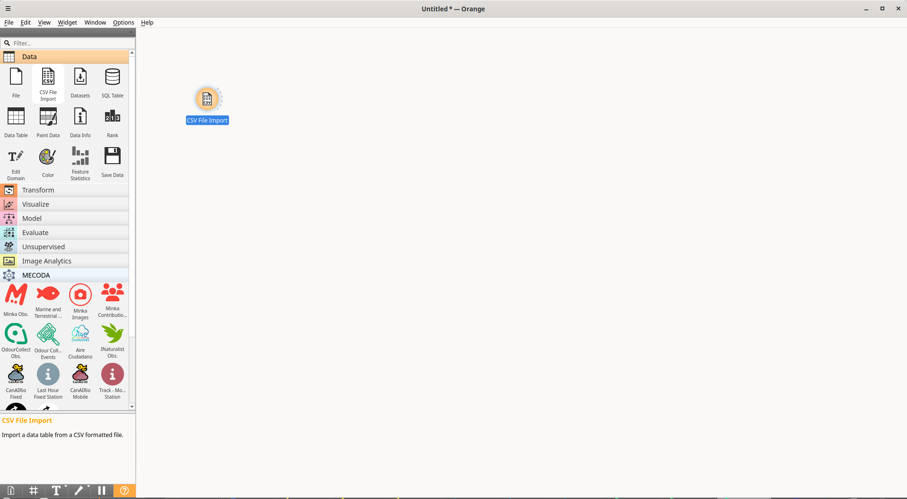
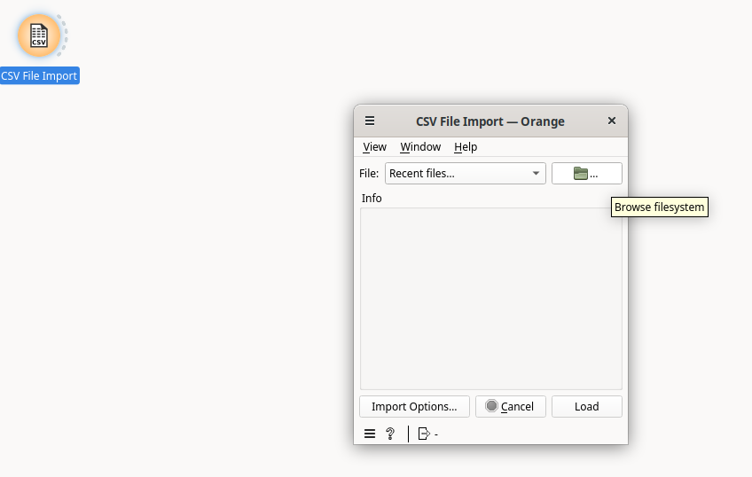
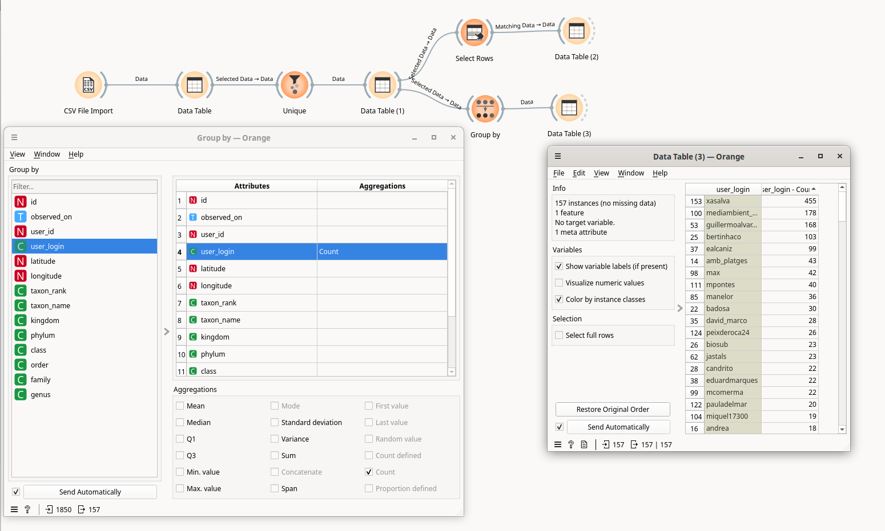
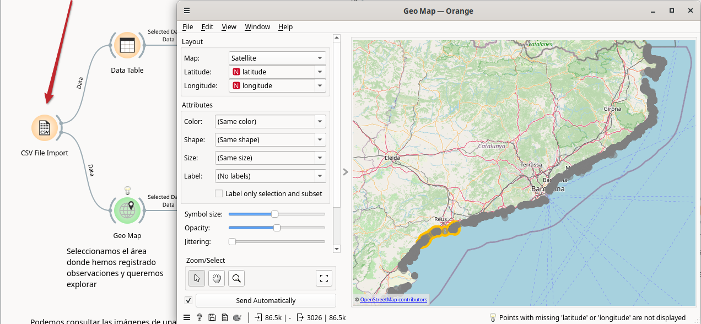
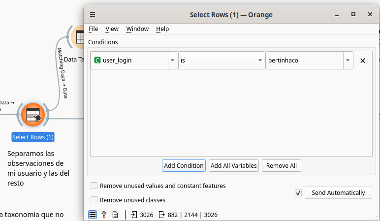

# Workshop for MINKA users with BioMARató 2024 data

## Exploring the complete BioMARató 2024 data

Data source: https://docs.google.com/spreadsheets/d/1-elmGwwjETJ6pch73aZG3bc4NlMXGqyokeM2JwFCYnc/edit?usp=sharing

These are the 86,000 observations that reached the research grade in BioMARató 2024. We are going to use them in our analysis. We download them to our computer in CSV format: in the Drive SpreadSheet, File -> Download -> Comma-separated values ​​(.csv).

Once downloaded, we are going to work with it within Orange. We open a new workflow (File -> New). We click on the CSV File Import widget (within the "Data" block in the left column).

When you double-click on it, you will see that the options open. If you go to the folder in the upper right corner, you can navigate to the csv on your computer and load it.

The next thing you need to do is click on "Import options" to determine the type of columns you want to work with. This way, you can use them in your workflow.

Click on each column and choose the type of data it contains:
- Numeric: for numeric data
- Datetime: for dates
- Text: this column will be considered text and will be discarded for the grouping and analysis processes.
- Categorical: this column, despite being text, is considered to indicate a category (a user name, a species name,...), therefore it can be included in the grouping and analysis.
- Ignore: this column will be ignored when loading the data.

Once we have determined the type of data, we connect "Data table" to explore the result.

## Have I made any first observations of a species at BioMARató 2024?

To answer this question, we can use the "Unique" widget, which allows us to keep the records of each group, based on the criteria we choose. In this case, we can group by the "taxon_name" values ​​that indicate the species and keep the first record for each one. Since the data is sorted by date, it will be the first record of a species in this dataset.

As we can see, we chose the "taxon_name" column in "Group by" and "First instance" in the "Instance to select to each group" field.

The result is the first observation of each of the 1850 registered species.

If we connect the "Select rows" widget we can keep those that are ours.

We can also connect "Group by" to count the number of first records of each user and see who has the most.

## Convert geographic coordinates to provinces or countries

We see that in our table we have almost 90,000 observations with a geographic data of longitude-latitude. But maybe we want to know how many observations we have in each province. We have a widget to convert geographic data into administrative boundaries. It is called "Geocoding". We can connect our loaded CSV with "Geocoding":

We must select the option "Decode latitude and longitude into regions", select the column where the latitude appears and the column with the longitude (if it does not detect them automatically) and then select the administrative level (Country / 1st-level subdivision, which corresponds here to the provinces).

The result is a new column that will appear like this:

From this column we can create other text columns, using "Create class":

## Species not recorded by me in my observation area

The first thing we do is connect the "Geo Map" widget to select an area where we have recorded observations and in which we want to compare our species with those of other users.

With the resulting observation table we are going to separate which observations are ours and which are not, using "Select rows":

From the table with our observations, we extract the species that we have recorded, using "Unique". We are left with a unique value for each species:

We are left with the "taxon_name" column only, using "Select column":

Now we create another column that will help us filter the species seen when we join this table with the table of all the other users.

The result is a table with two columns: one with the names of the taxonomies seen and another with the column that will act as a filter. We will use the "Merge Data" widget to join both tables. First we will connect the table of observations from other users and then we will connect the table of taxonomies viewed (Extra data connection for this table).

In the "Merge data" widget we must indicate the option "Append columns from Extra data" and in Row matching match the rows by "taxon_name". The result is a table where a new "viewed" column will be added where the value will be "Y" or whatever we indicate for all those observations where the "taxon_name" is present in the viewed table.

## Resulting workflow

You can find the resulting workflow for this exercise [here](workflows/datathon_feb25_biomarato_part2.ows) and download it to open it within your Orange.

# Acknowledgement

&nbsp;&nbsp;&nbsp;&nbsp;&nbsp;&nbsp;&nbsp;&nbsp;&nbsp;&nbsp;&nbsp;&nbsp;