# Ejemplo con el widget de OdourCollect
Después de instalar Orange y añadir en el menú "add-ons" el paquete Mecoda-Orange encontraremos el paquete disponible en la columna de la izquierda. Dentro de MECODA está el widget de OdourCollect. Haciendo clic sobre él nos aparecerá en el espacio blanco de la plataforma, donde podremos crear nuestro workflow:

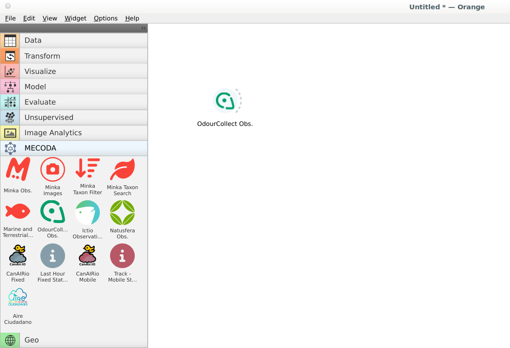 

Haciendo doble clic sobre el widget, abrimos el menú donde podemos indicar filtros por fecha, por intensidad, por tono hedónico, categoría y tipo. En este caso queremos descargar todos los olores registrados, y que nos indique la distancia respecto a un punto, el de "Aigües de Barcelona - EDAR del Besòs". En Lat-Lon indicamos estos parámetros que habremos sacado de Google Maps:
* Latitude: 41.409940771041526
* Longitude: 2.222960630687475

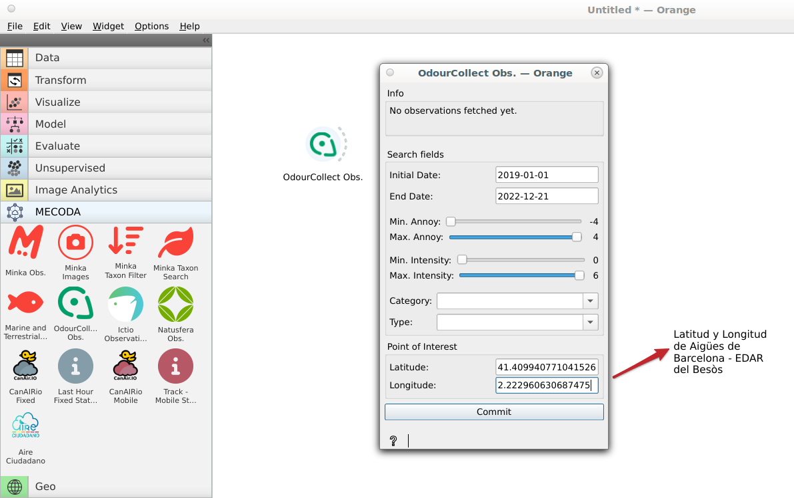 

Pinchando en "Commit" hacemos la petición a la página de OdourCollect de los datos. Cuando finalice la petición conectamos la salida de ese widget con el widget "Data Table" para ver lo que hemos obtenido. Veremos que una de las columnas se llama "distance" y ahí aparece la distancia en kilómetros respecto al punto que hemos indicado:

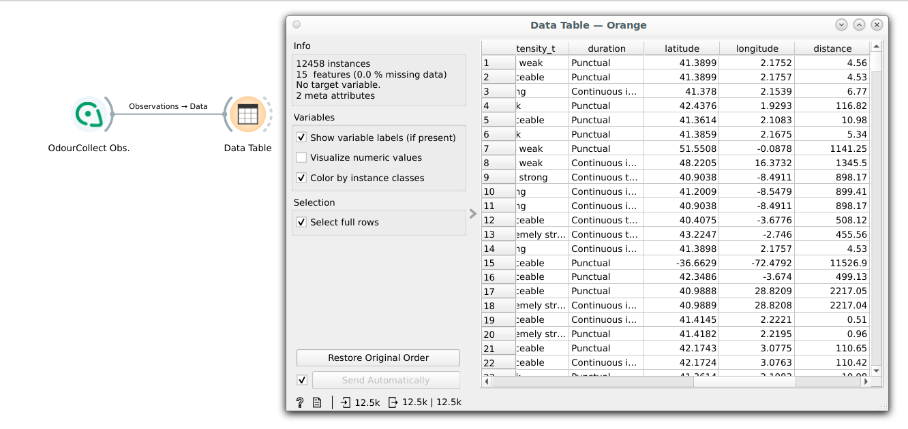 

Como lo que queremos analizar son los olores del área del punto indicado, vamos a filtrar esa tabla por los olores que están a una distancia máxima de 3km respecto al punto indicado. Usamos el widget "Select rows", indicando la columna `distance` y usando como parámetro `is below` 3. 

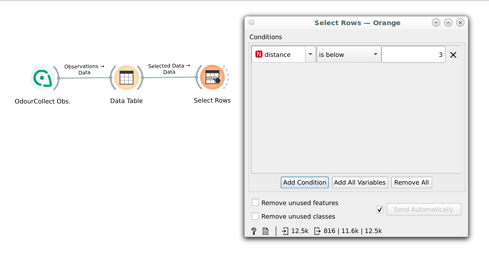 

De los 12.500 registros que teníamos nos quedamos con 816, que son los que están en el área de 3 km alrededor del punto indicado:

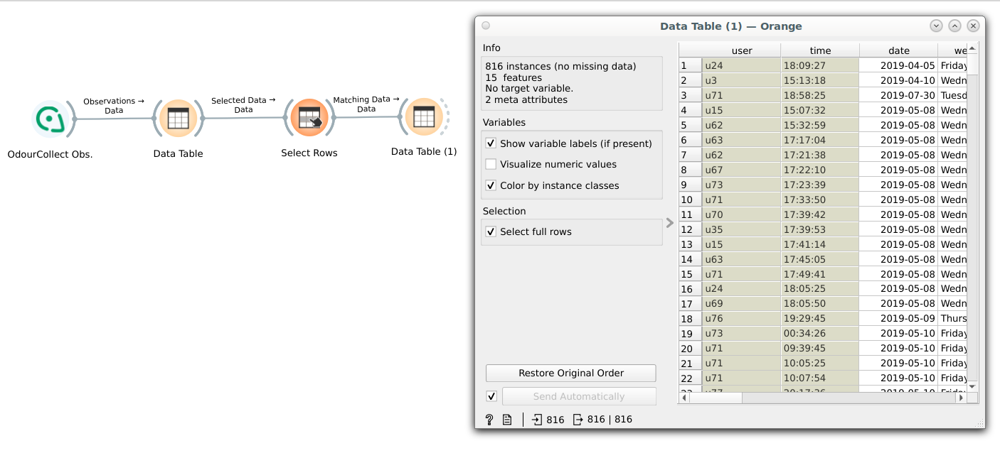 

Vamos a analizar esos olores. Usamos el widget `Distributions` para ver los olores según la fecha (date). Aquí podemos verlos agrupados por años, donde podemos comprobar que el registro de olores en esta zona ha sido mayor en 2019 y ha ido disminuyendo cada año:

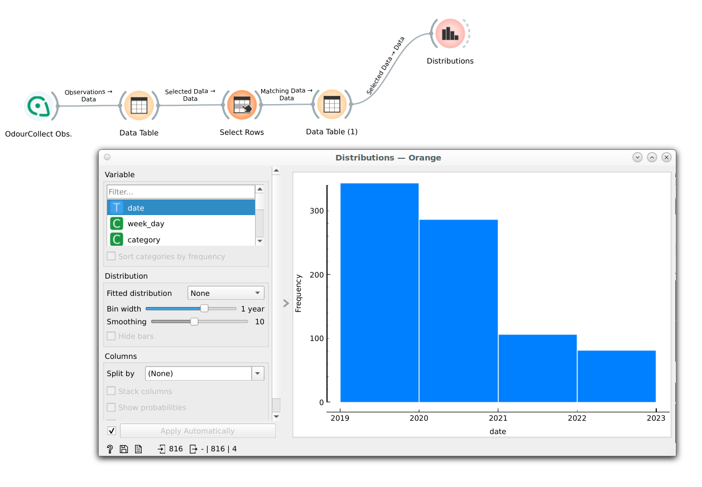 

O si cambiamos el parámetro `Bin width` a meses podemos ver que el registro de olores no es constante todos los meses, sino que parece haber "picos" en los meses de verano:

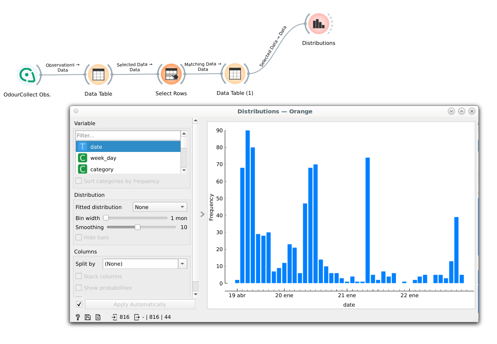 

Lo siguiente que podemos comprobar es qué día de la semana es el que se registran más olores. Usamos de nuevo el widget `Distributions` con la variable "weed_day". Así comprobamos que el jueves es el día que más registros se dan. Los fines de semana el número de registros es menor.

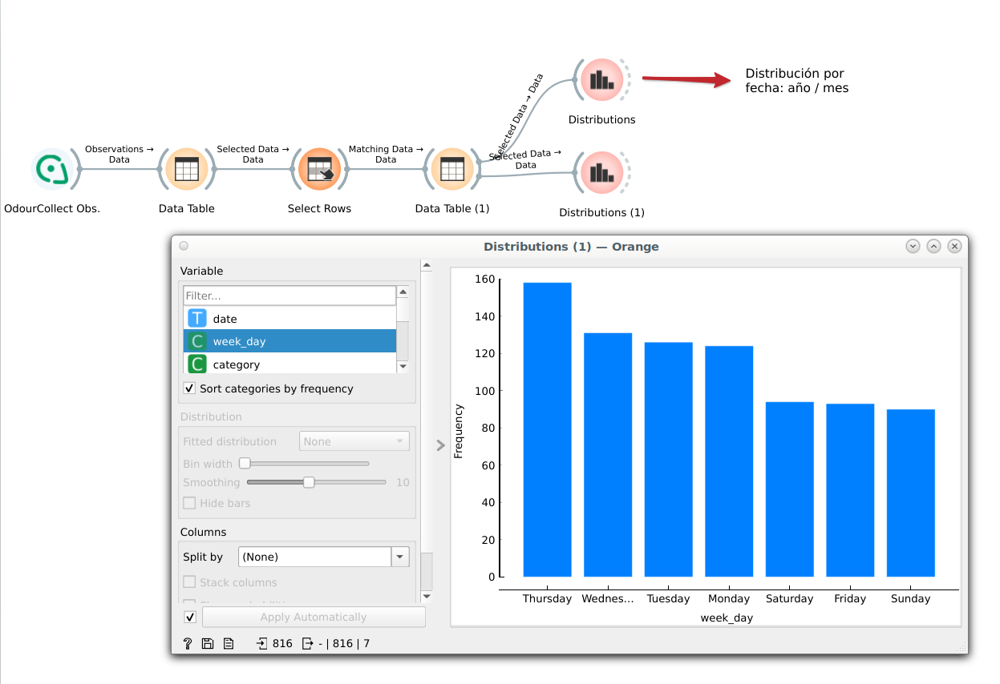 

Y si lo que queremos ver son las horas a las que se reportan más olores, simplemente seleccionamos la columna `time_hour` para ver la distribución horaria:

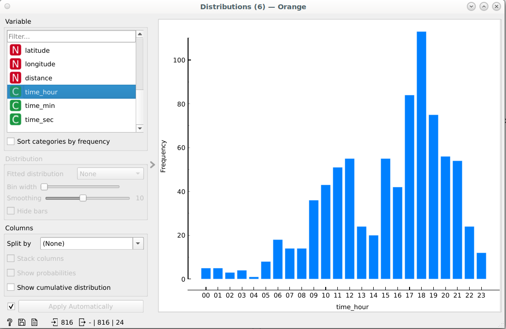 

Ahora vamos a ver cuántos usuarios han registrado olores en esta zona, y si lo hacen muy frecuentemente. Pero el campo de "user" es un campo de texto, no podemos hacer cálculos con él. Para convertirlo en una categoría usamos el widget `Edit Domain` y convertimos la columna user en una categoría que poder utilizar:

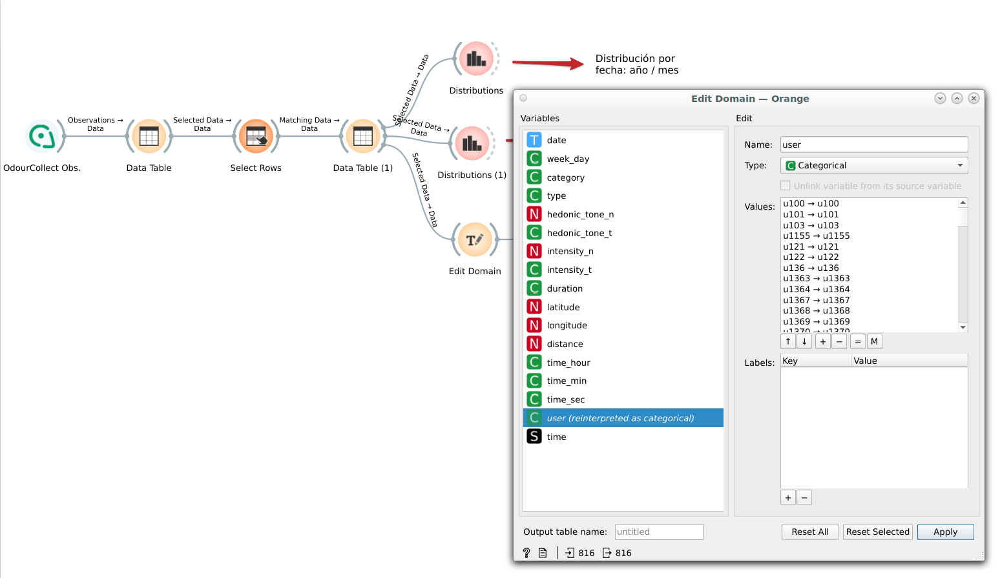 

Ya podemos conectar esa salida con el widget de distribución y vemos que unos pocos usuarios hacen muchos registros, y la gran mayoría de usuarios hacen un único registro. El un comportamiento habitual de uso en la aplicaciones de internet:

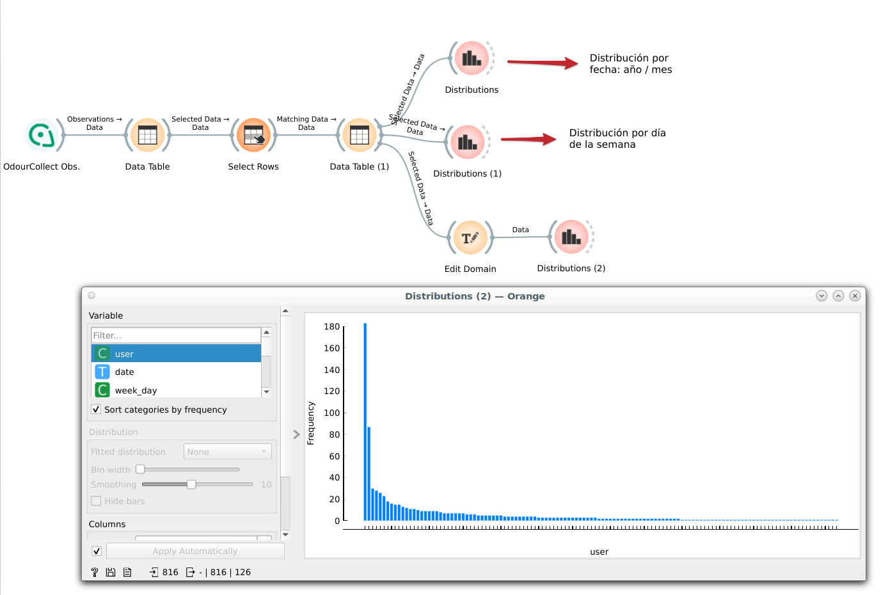 

Vamos a analizar el tono hedónico y la intensidad de las distintas categorías de olor de esta zona. 

Usamos el widget `boxplot`, seleccionamos en primer lugar la variable `hedonic_tone_n` (tono hedónico en valor numérico, del -4 al 4) y agrupamos según categoría. Así obtenemos una barra por cada categoría. La longitud de la barra nos dirá lo disperso que está el tono hedónico en esa categoría y la raya vertical nos dirá la maedia de la categoría. La categoría que tiene el tono hedónico medio más bajo es "Waste", seguida por "Waste Water":

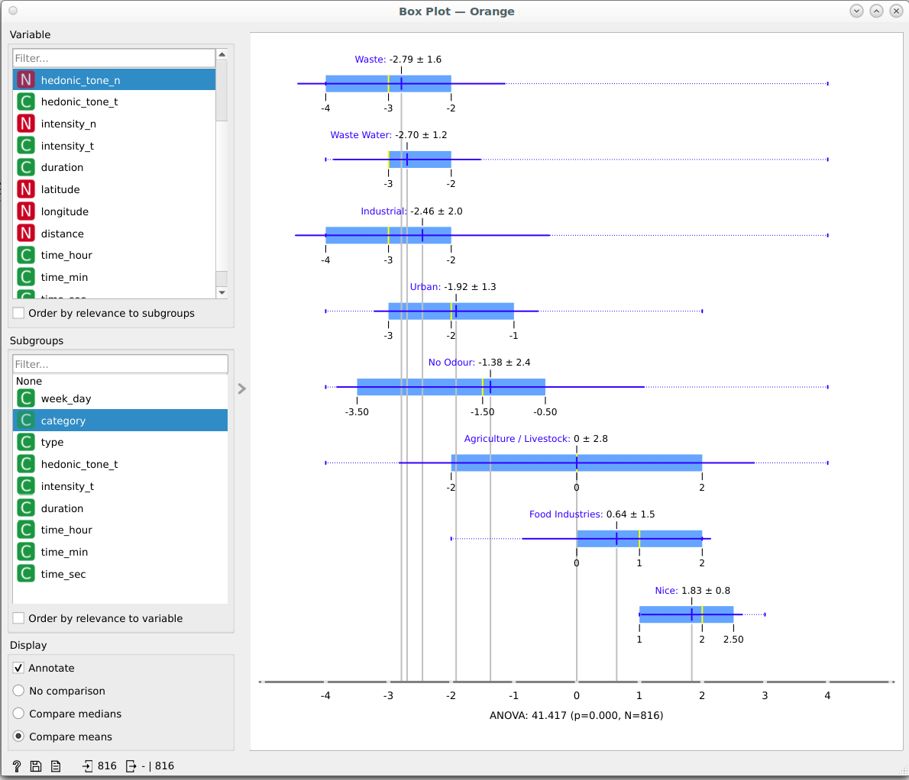 

Si atendemos a la intensidad, cambiando la variable utilizada por "intensity_n" (intensidad en valor numérico), veremos que son menos intensos, de media, los olores buenos (categoría "Nice" y "Food industries") y más intensos los olos de basura e industria. 

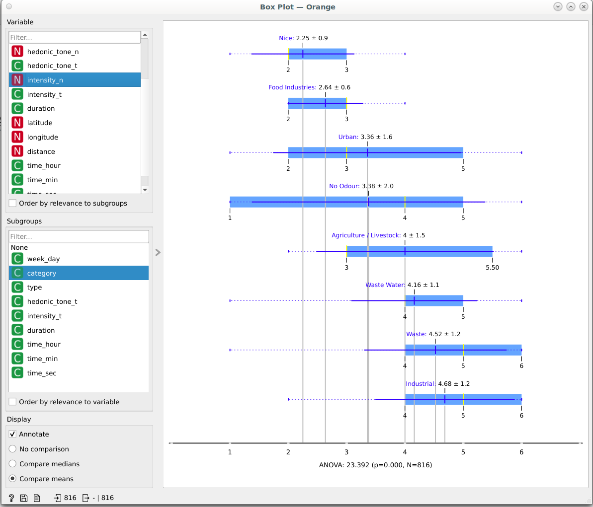 

Si lo que queremos es analizar el número de olores de cada categoría o tipo, usaremos el widget `Distributions` en lugar del widget `Boxplot`. Este widget nos dará número de apariciones, sobre todo útil en campos de texto. El boxplot nos representará campos numéricos, donde podemos ver media, mediana, desviación, etc. Aquí está el número de olores por categoría:

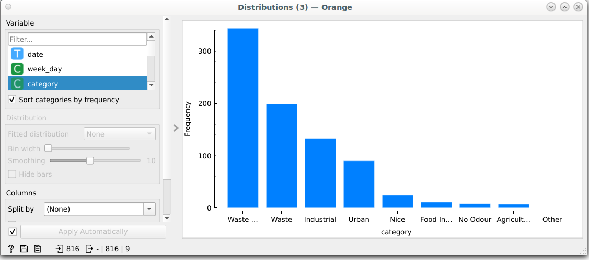 

En caso de que queramos analizar qué peso tiene cada tipo de olor dentro de cada categoría, es decir, qué tipos de olor son los más relevantes dentro de cada una de las categorías, podemos utilizar el widget de `Pivot Table` (o tabla dinámica), que nos permite cruzar dos columnas. Colocamos las categorías como columnas y los tipos como filas, y seleccionamos "count" con cualquiera de las otras variables:

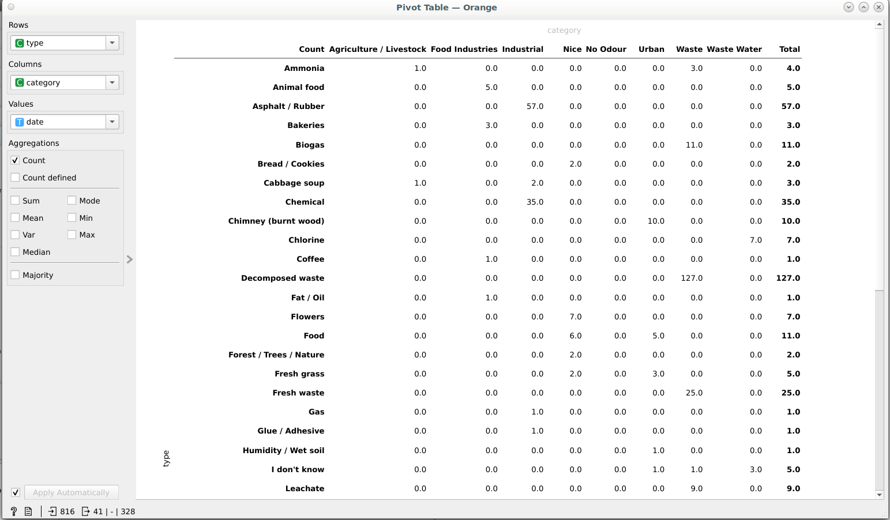 

Si convertimos esta tabla dinámica en una tabla, usando el widget "Data Table" podremos ordenar cada una de las columnas de forma descendente y ver cuáles son los tipos más frecuentes de cada una de ellas:

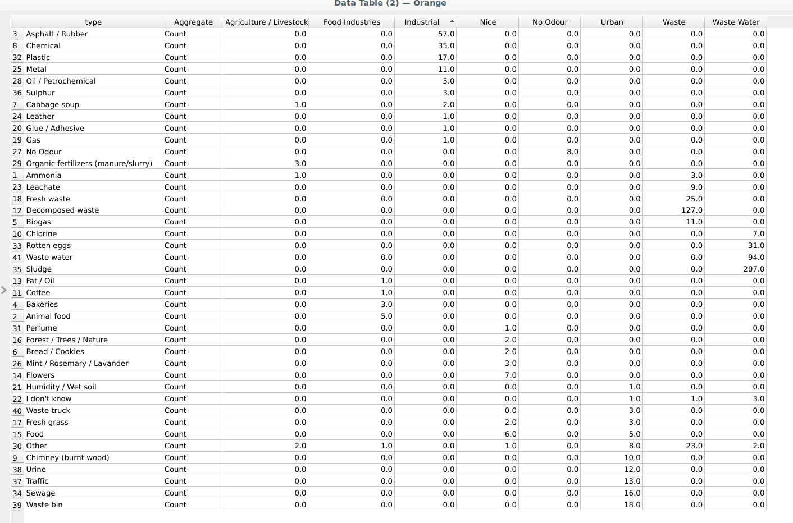 

Y si queremos ver estos registros en un mapa usamos el widget `Geo Map` y podemos situar cada punto sobre un mapa de Satélite, por ejemplo, y colorearlos por categoría:

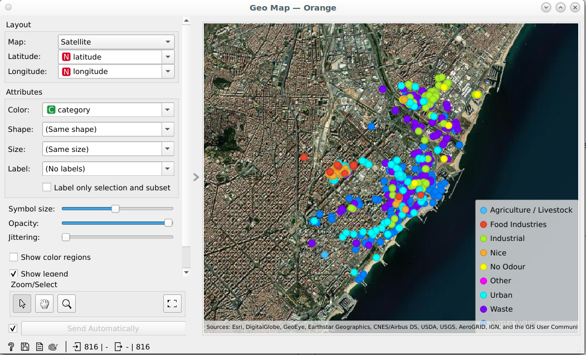 

Por último, si queremos analizar un grupo concreto de los olores de esta zona, podemos volver a utilizar el widget `Select Rows` y filtrar por aquellos olores que se corresponden a un tipo concreto, por ejemplo "Waste water":

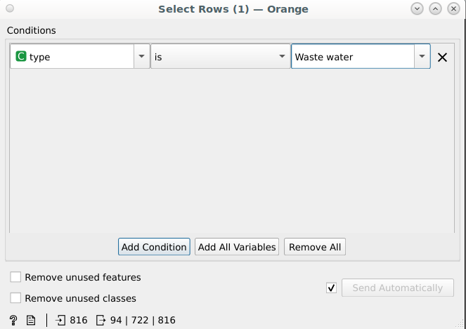

Con la salida de este filtro podemos analizar, por ejemplo, cuál es la duración de los olores de este grupo, como hemos visto anteriormente:

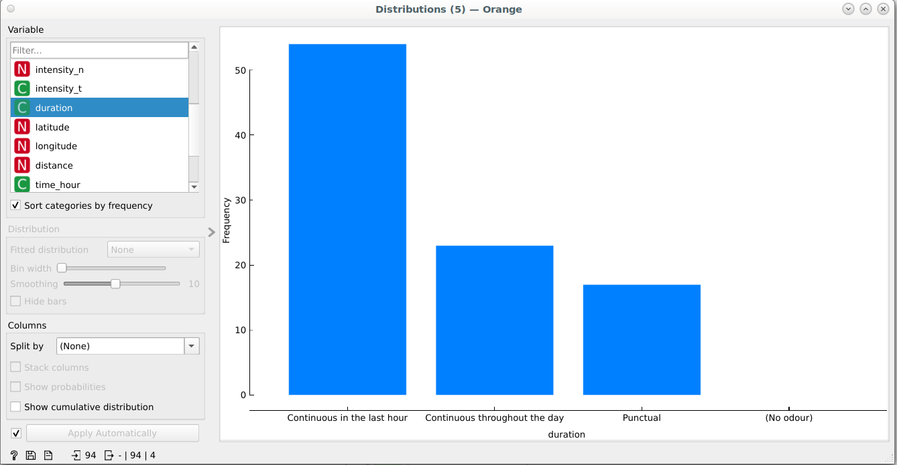

En conjunto, hemos hecho un análisis a distintos niveles de los olores cercanos a un punto de interés y hemos visto sus características, su distribución, su localización, etc. El workflow que obtenemos lo podemos guardar en formato .ows (propio de Orange) y abrirlo cuando queramos para poder repetir el análisis:

 

También podemos generar informes a partir de cada uno de los widgets, como se puede ver en este ejemplo: [Informe](images/informe.html).