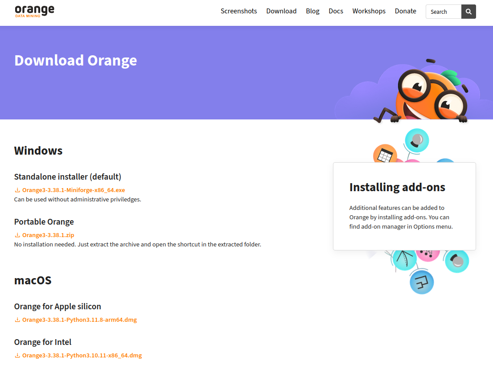

# Installation Guide

1. Instala Orange Data Mining a través de https://orangedatamining.com/download 

 

Haz click en "Download Orange".

2. Una vez instalado (tarda unos 15 min y te pedirá que también instales Miniconda en el proceso), abre Orange desde el menú de tu ordenador o desde el enlace en el escritorio. Verás algo como esto:

 

3. Ve al menú "Options" en la barra de menú superior y secciona "Add-ons":

 

4. En el pop-up que se abre haz click en "Add more...", en la parte superior derecha. Una ventana de búsqueda aparecerá llamada "Add add-on by name". Escribe "mecoda-orange" en la barra de búsqueda y haz click en   "Add".

 

5. ***Mecoda Orange*** aparecerá disponible en la lista de paquetes de instalación, en último lugar. Marca la cajita junto al nombre y haz click en OK para instalarlo. Si el proceso sale correctamente Orange te pedirá que lo reinicies al terminar. 

 

ATENCIÓN: Si aparece un error en este proceso antes de que informe de que el paquete se ha instalado el proceso, pincha OK y repite el proceso (añade en Add-ons mecoda-orange, click la caja en la lista de paquetes y dale a OK en instalar). Si la primera vez ha fallado en esta ocasión irá más rápido.

6. Necesitaremos otros paquetes para nuestro ejemplo de uso, así que después de la instalación de MECODA vamos de nuevo a "Options" > "Add-ons" y seleccionamos del listado los paquetes ***Geo*** e ***Image Analytics***.

 

7. Después de seleccionar estos dos paquetes, pinchamos en **OK** para instalarlos. Orange nos volverá a pedir reiniciar.

 

8. Orange se reiniciará y la interfaz mostrará nuestros paquetes instalados en la columna de la izquierda:

 