# Análisis de observaciones de la especie Asparagopsis taxiformis en la costa catalana

Vamos a analizar las observaciones de la especie **Asparagopsis taxiformis** en la costa catalana (enlace al [place en MINKA](https://minka-sdg.org/places/catalunya)). 

Para ello utilizamos el widget MINKA obs. y los filtros:
- Taxon name = Asparagopsis taxiformis
- Place url = https://minka-sdg.org/places/catalunya

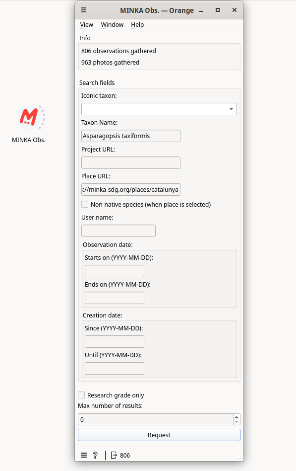 

El resultado, como vemos en la parte superior del widget, es de 806 observaciones y 963 imágenes.

Si dibujamos una línea desde ese widget y soltamos nos aparecerá una lista con los widgets con los que se puede conectar la salida. Entre ellos estará "Data table", que nos permite explorar los datos que hemos descargado:

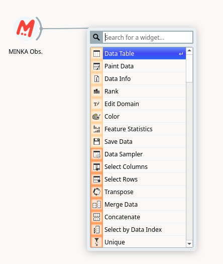 

Al seleccionar "Data table" nos aparecerá un diálogo para que elijamos los datos de la salida que queremos mostrar en la tabla, a elegir entre observaciones, fotos o usuarios:

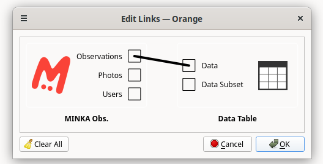 

Con las observaciones, podremos hacer un análisis estadístico. Con las fotografías, explorar las imágenes reportadas, y con los usuarios, analizar aquellos que han participado subiendo observaciones o ayudando a identificarlas.

## Exploración de las imágenes

Comencemos explorando las imágenes, que nos ayudará a reconocer la especie que estamos analizando. Dibujamos una línea entre Photos y Data (la salida de uno y la entrada del otro).

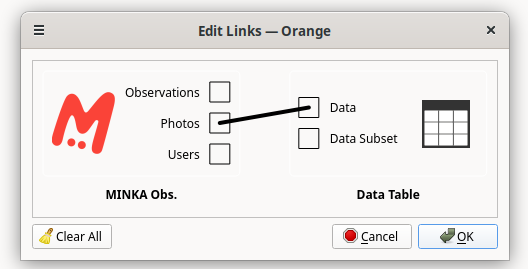 

El resultado es la tabla con las imágenes vinculadas a las observaciones.

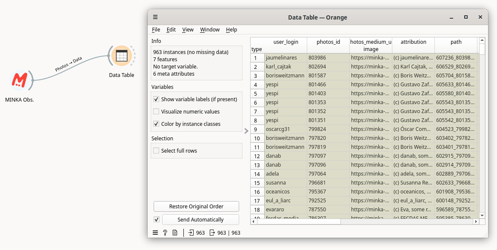 

Lo que nos gustaría es ver esas imágenes, para descubrir de qué especie estamos hablando. ¿Cómo lo hacemos?

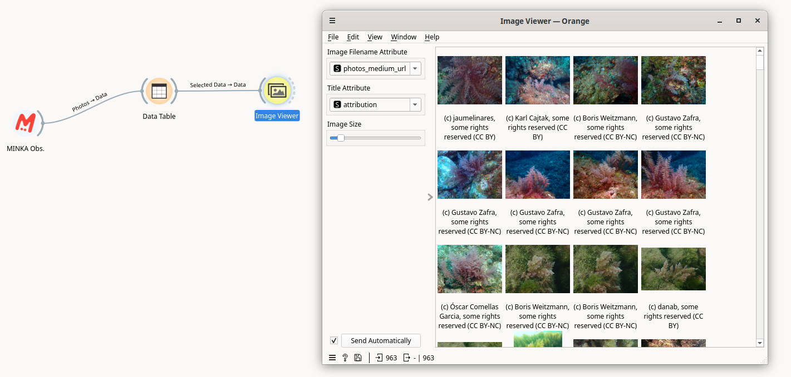 

## Exploración de los datos

Conectamos las observaciones salidas de MINKA widget a otra tabla:

 

Vemos que el resultado contiene el total de las observaciones descargadas:

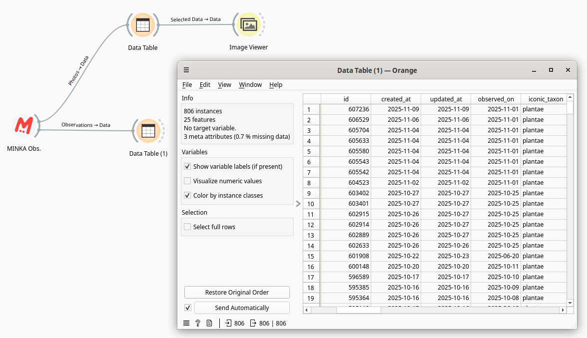 

Conectamos el widget de distribución, para analizar la distribución temporal, eligiendo el campo "observed_on", que incluye la fecha de la observación, y el periodo que más nos interese en "Bin width" (anual, semestral, trimestral,...).

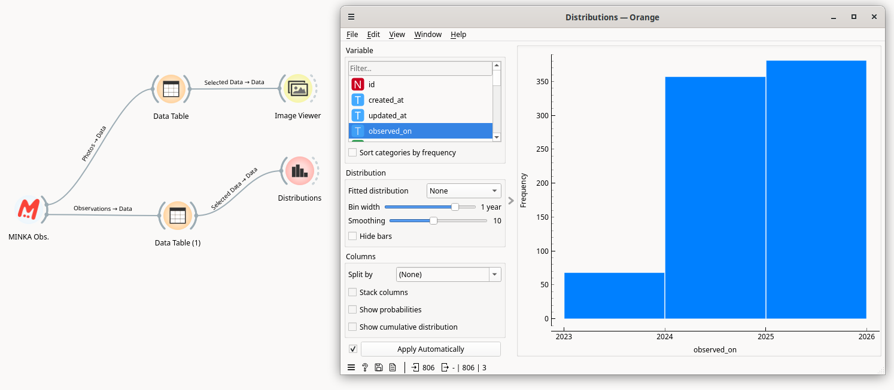

Podemos usar este mismo widget para ver las observaciones por usuario, por fecha de subida a MINKA (created_at), por grado alcanzado por la observación (quality_grade), por dispositivo utilizado para subirla a MINKA (device), etc. Todo ello cambiando el campo que muestra la distribución como gráfico de barras.

Este gráfico puede funcionar, a su vez, como filto de las observaciones. Si, por ejemplo, pinchamos sobre la columna de 2023 en el campo "observed_on" y conectamos un "Data table" a la salida de ese widget, tendremos las observaciones de ese año filtradas en una tabla.

Si repetimos este proceso, tendremos tablas separadas con las observaciones de cada año. Podemos seleccionar los dos widgets y copiarlos debajo para reproducir el proceso. Renombrando el widget de la tabla, tendremos más claro qué datos tiene cada tabla. Para renombrar un widget basta con pinchar con el botón derecho en el centro del widget y seleccionar "Rename".

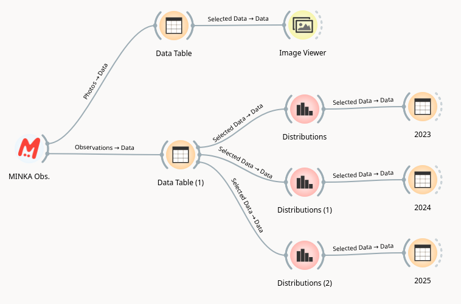

Con la tabla de las observaciones de cada año, podemos analizar la distribución espacial, conectándola al widget "Geo Map". Este nos permite utilizar los campos latitud y longitud presentes en los datos para representarlos sobre un mapa. 

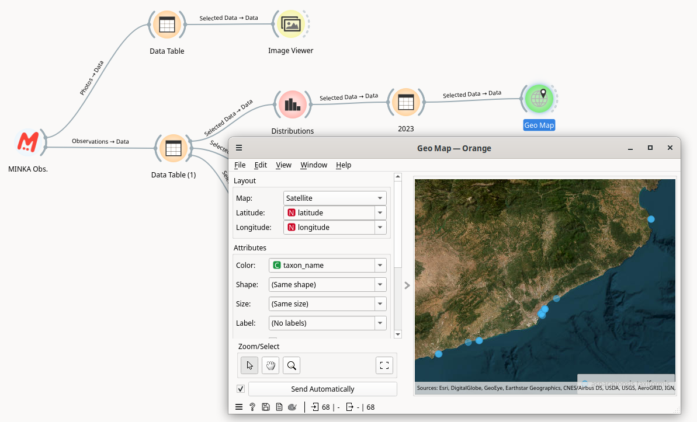

El aspecto de este puede seleccionarse en el campo "Map" del apartado "Layout":

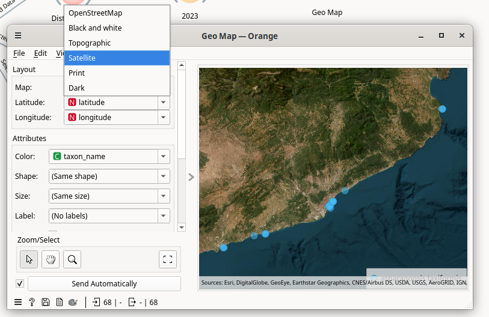

Si hacemos lo mismo con cada tabla de datos de cada año podremos ver si hay diferencias en la distribución anual de las observaciones, entre esos mapas.

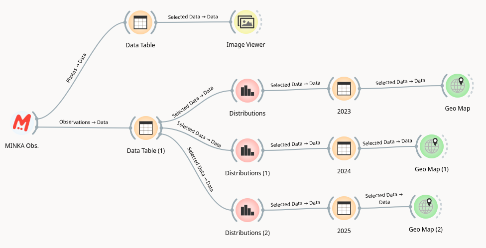

Tal vez la superposición de los puntos en las mismas zonas no nos deje apreciar las diferencias. Para ello podemos usar la opción "Jittering", que nos distribuye los puntos en la zona para evitar la superposición:

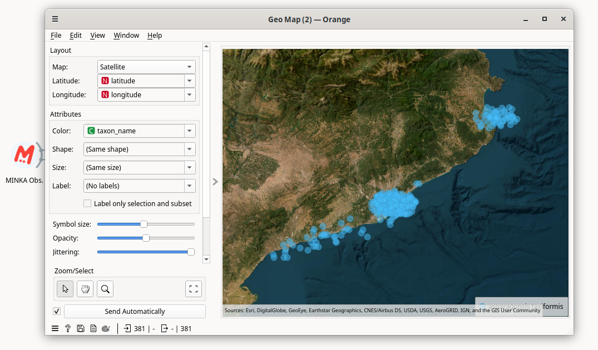

Esto nos permite tener un conocimiento de la distribución espacial en el mapa. Y seleccionando uno o varios puntos podemos usar este mapa también como filtro y sacar las seleccionadas a otra tabla. 

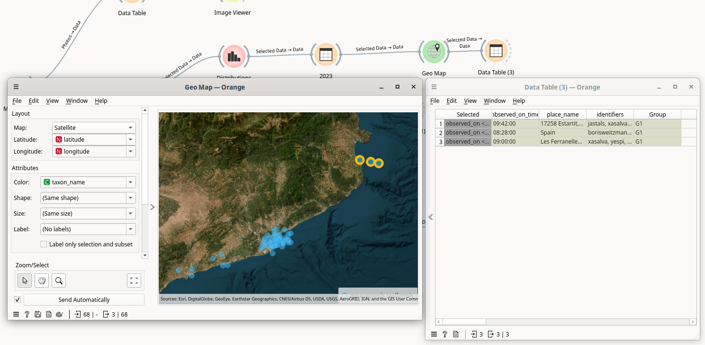

Y si queremos ver las fotos de estas observaciones seleccionadas, pero solo tenemos los datos, podemos usar el widget MINKA images y obtener los datos necesarios para ya conectarlo al Image Viewer:

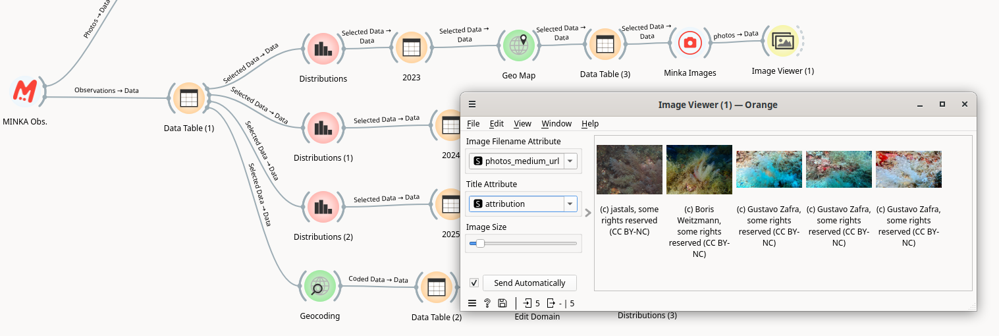

Pero tal vez lo que queremos es conocer la distribución administrativa, es decir, el número de observaciones por provincia y solo disponemos de los datos de latitud y longitud. Podemos utilizar Geocoding:

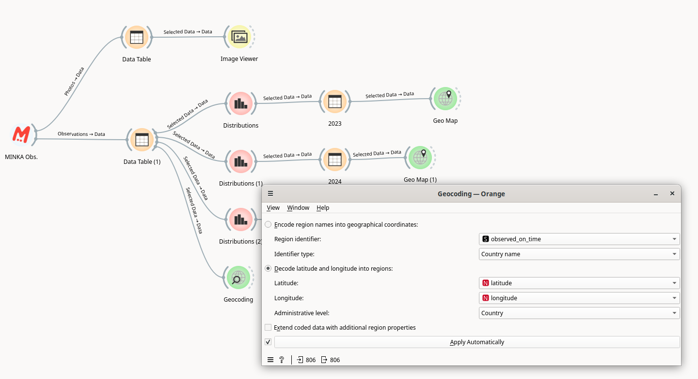

En ese widget debemos seleccionar la opción "Decode latitude and longitude into regions" y comprobamos que esas dos columnas en nuestros datos están bien identificadas. También elegiremos el nivel administrativo, al inferior que nos permita (el superior será el país). 

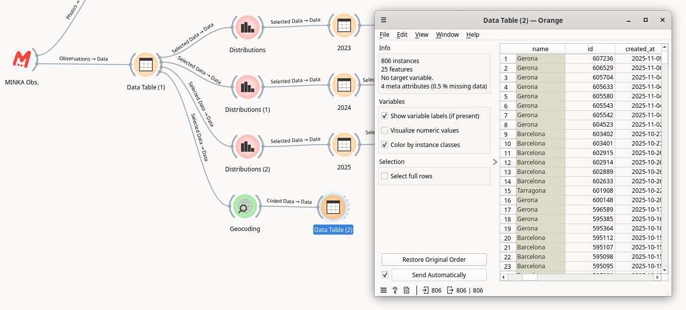

El resultado será una nueva columna con la provincia, que aún no podremos utilizar en nuestro análisis, hasta convertirla en una categoría. Conectamos esta tabla con "Edit domain" para editarla. 

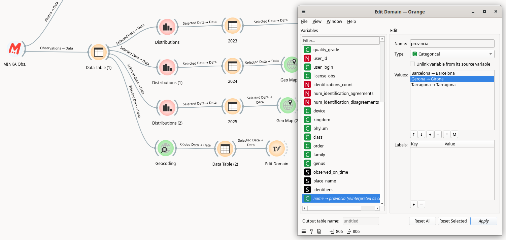

En "Edit domain" seleccionamos la columna a editar, que aparecerá de última, llamada "name". La renombramos a "provincia", para facilitar su localización. Cambiamos el tipo a categorical, y así nos permitirá también editar las diferentes categorías y así sustituir "Gerona" por "Girona". Una vez hecho esto podremos ver el número de observaciones por provincia.

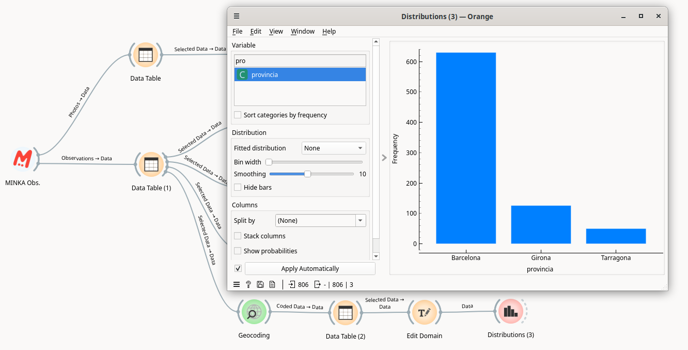

Imaginemos ahora que queremos filtrar las observaciones por varios criterios. Encadenar los widgets de distribución sería muy tedioso. Podemos utilizar el widget "Select rows" que nos permitirá añadir tantos criterios como queramos para seleccionar las observaciones:

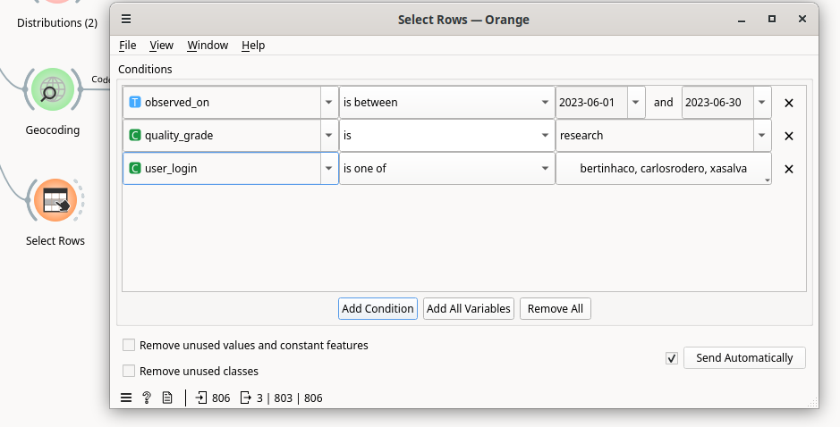

Por último, estos datos se pueden descargar localmente utilizando el widget "Save Data", desmarcando la opción "Add type annotations to header", para que la cabecera quede limpia. Al pinchar en "Save as" podremos elegir dónde los guardamos y en qué formato (tab, xlsx, csv...).

Y podemos hacer lo mismo con las imágenes, seleccionando una de ellas de Image Viewer y conectándola con Save image:

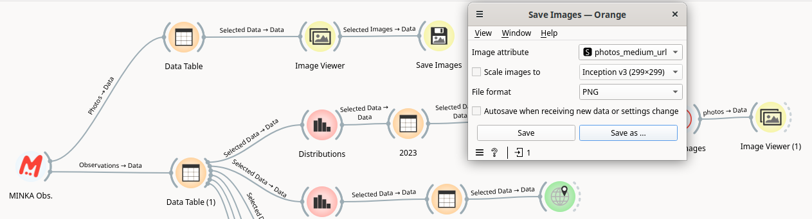

## Comparación con los datos de iNaturalist de esa especie

El paquete MECODA incluye también un widget para acceder a los datos de iNaturalist. Vamos a buscar las observaciones de esta especie en Catalunya. Seleccionamos el widget iNat. Asparagopsis taxiformis tiene el id 208548 en iNat y Catalunya tiene el id 61614. Descargamos los datos así:

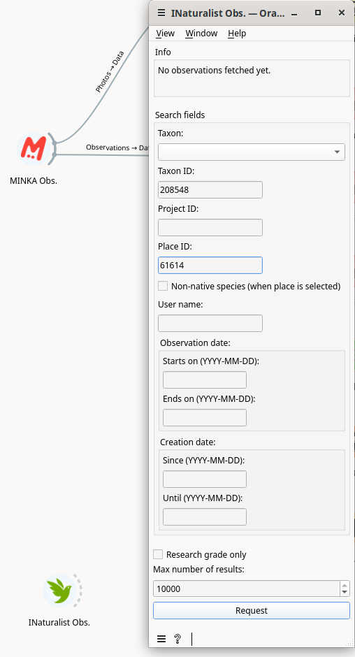

El resultado son 23 observaciones:

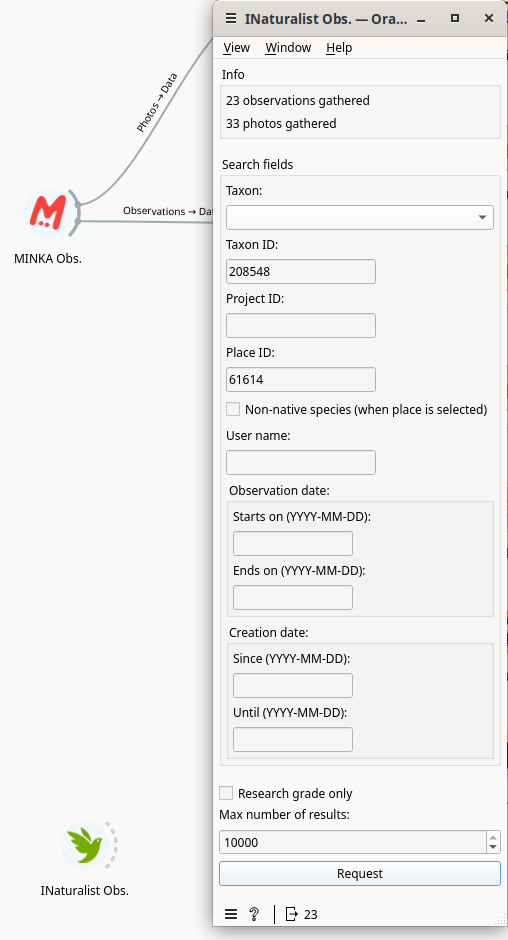

Podemos explorarlos de la misma forma que hicimos con las observaciones de MINKA:

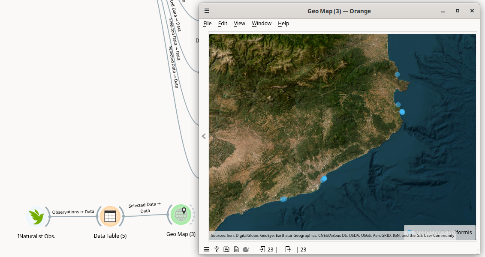

## Workflow resultante

El resultado de este workflow se puede guardar y se puede reproducir con otra especie, simplemente cambiando los datos seleccionados en el primer widget de MINKA Obs.

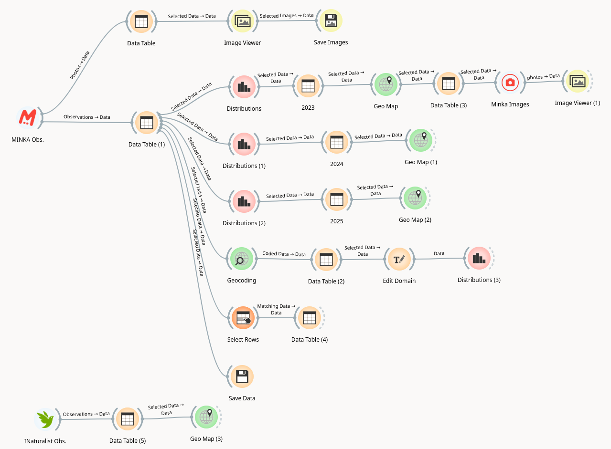

Para guardarlo solo tenemos que pinchar en el menú superior izquierdo en File > Save as y elegir la localización para guardarlo. El archivo guardado tendrá el formato .ows, propio de Orange. Se podrá abrir en Orange únicamente utilizando File > Open.