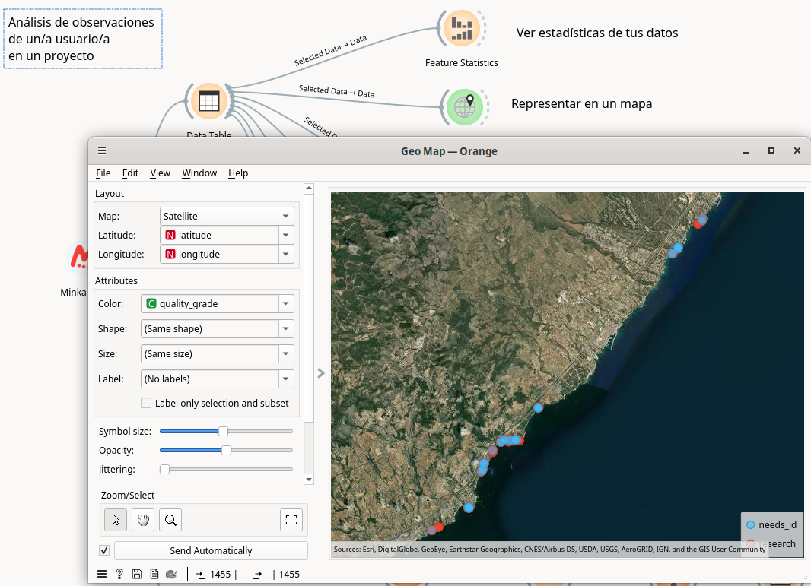
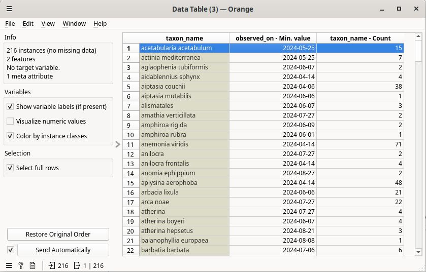
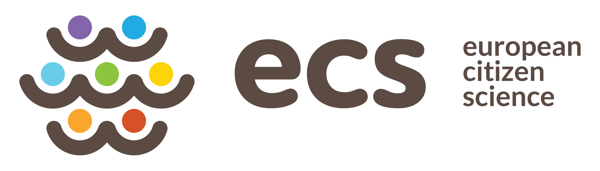

# Taller con usuarios de MINKA con los datos de BioMARató 2024

## Instalación de Orange: 

1. Instala Orange Data Mining a través de https://orangedatamining.com/download 

 

Descarga la versión adecuada para tu sistema operativo (Windows o macOS). Si tienes alguna distribución de Linux, sigue los pasos para instalar Orange utilizando [Anaconda](https://www.anaconda.com/download) o pip (si lo tienes instalado).

2. Una vez instalado (tarda unos 15 min y puede que te pida que también instales Miniconda en el proceso), abre Orange desde el menú de tu ordenador o desde el enlace en el escritorio. Verás algo como esto:

 

* Instalación de los add-ons necesarios: `mecoda-orange`, `Image Analytics` y `Geo`. 

Ve al menú "Options" en la barra de menú superior y secciona "Add-ons":

 

En el pop-up que se abre haz click en "Add more...", en la parte superior derecha. Una ventana de búsqueda aparecerá llamada "Add add-on by name". Escribe "mecoda-orange" en la barra de búsqueda y haz click en "Add".

 

***Mecoda Orange*** aparecerá disponible en la lista de paquetes de instalación, en último lugar. Marca la cajita junto al nombre y haz click en OK para instalarlo. Si el proceso sale correctamente Orange te pedirá que lo reinicies al terminar. 

 

Necesitaremos otros paquetes para nuestro ejercicio, así que después de la instalación de MECODA vamos de nuevo a "Options" > "Add-ons" y seleccionamos del listado los paquetes ***Geo*** e ***Image Analytics***.

 

Después de seleccionar estos dos paquetes, pinchamos en **OK** para instalarlos. Orange nos volverá a pedir reiniciar.

 

Orange se reiniciará y la interfaz mostrará nuestros paquetes instalados en la columna de la izquierda:

 

## Exploración de la interfaz de Orange.

El aspecto de la aplicación es este:

 

1. Columna de widgets.
2. Área de creación del flujo de datos.

En la columna de la izquierda, identificada con el número 1, están los widgets agrupados por tipo:
* **Data**: para importación desde diferentes formatos, ver los datos, ver las estadísticas generales, obtener información del dataset o guardar los datos.
* **Transform**: para seleccionar columnas, filas, transposición, combinación de tablas, agregación, valores únicos, randomización, tablas dinámicas, discretizar valores, etc.
* **Visualize**: incluye diferentes formas de representar gráficamente los datos, como árbol, gráfico de violín, de dispersión, de barras, histogramas, etc.
* **Model, Evaluate, Unsupervised**: herramientas para trabajar modelos de datos, propios de machine learning.

A estos añadiremos los add-ons que nos servirán para realizar nuestro análisis de datos de biodiversidad:
* **MECODA**: widgets que conectan con los datos de diferentes observatorios de Ciencia Ciudadana (Minka, OdourCollect), datos de sensores DIY como CanAIRio, Aire Ciudadano o Smart Citizen.
* **Image Analytics**: incluye widgets para el tratamiento de imágenes, que permite verlas dentro de Orange o utilizar modelos de imágenes para encontrar similitudes.
* **Geo**: para la realización de mapas (de puntos o sombreados) y para la geocodificación de valores de latitude y longitud a regiones administrativas.

NOTA: Puedes consultar toda la información sobre cómo utilizar cada uno de estos widgets en el [catálogo](https://orangedatamining.com/widget-catalog/). 

Los widgets se seleccionan en esta columna izquierda, y aparecen en el área blanca de la derecha (número 2). Para seleccionar el widget basta con clicar una vez sobre él, en la columna de la izquiera.

Cada widget, cada una de estas herramientas disponibles, puede comunicarse con otros widgets de diferentes formas:
* Un widget puede admitir como entrada la salida de otro widget y dar como resultado una salida, que se pueda comunicar con un siguiente widget.
* Puede generar una salida y no admitir ninguna entrada.
* Puede admitir una entrada, pero no dar ninguna salida.

Aquí vemos un ejemplo:

 

En este caso, vemos que hemos seleccionado del menú de la izquiera tres widgets:
* *CSV File Import*, un widget para importar un csv, tiene una línea curva punteada en el lado derecho. Eso quiere decir que este widget puede dar una salida, pero no admite ninguna entrada (el flujo de datos va de izquierda a derecha).
* *Distributions*, un widget para obtener el histograma o distribución de una columna de nuestros datos, tiene línea curva punteada en ambos lados. Es decir, puede recibir información (una tabla de datos) desde el lado izquierdo y puede conectarse con otro widget por el lado derecho.
* *Save Images*, un widget para guardar imágenes en nuestro ordenador. Este widget sólo tiene línea curva en el lado izquierdo. Eso quiere decir que admite entradas, pero realizará el proceso para el que está diseñado (descargar las fotos) y no tendrá ninguna salida en Orange.

Este ejemplo es para explicar solamente cómo se conectan los diferentes widgets, necesario para construir los flujos de datos o data workflows.

Estos widgets se conectarán de esta forma:

 

Aquí vemos que se crea una línea entre los widgets, que comunica la información de unos a otros. Si esta línea no es continua, nos indica que no se está transmitiendo ninguna información de uno a otro, como en este caso. Sobre la línea se indica qué se está transmitiendo: Data (todos los datos) o Selected Data (sólo los datos que hayamos seleccionado en el widget inicial).

# Análisis de datos de usuario de la BioMARató

## Análisis de los datos del usuario/a

Lo primero que haremos será acceder a los datos de cada usuario/a en MINKA dentro del proyecto de la BioMARató 2024.

Usaremos el widget de MINKA y los siguientes filtros:
- Project URL: https://minka-sdg.org/projects/biomarato-2024-catalunya
- User name: <tunombreenminka>

El resultado será este:
 

En la parte de arriba nos indicará los datos que se han descargado desde MINKA: un número de observaciones y un número de fotografías. 
Como sabes, en MINKA una observación puede incluir más de una foto, por eso es normal que haya más fotografías que observaciones.

Este widget tiene una zona punteada en el lado de la derecha. Eso indica que tiene salida y esa salida se puede conectar con otros widgets.

Arrastramos una línea desde esa zona punteada y soltamos para que nos dé la opción de elegir qué widget queremos conectarle.

Así podemos "engancharlo" con el widget que nos permitirá ver los datos, llamado "Data Table":

Una vez hayamos pinchado en "Data Table" nos dará la opción de cargar en ese widget tres tipo de datos: "Observations", "Photos", "Users". Esto es porque nuestro widget de Minka tiene tres salidas, una tabla con todas las observaciones y una tabla con todas las fotos y una tabla con los usuarios que han participado como observadores o identificadores en estas observaciones (de cara a citarlos si se utilizan los datos). 

La primera tabla nos permitirá hacer análisis estadístico:

Seleccionamos coger las observaciones (Observations -> Data) y eso cargará las observaciones en la Tabla. Le damos a OK y veremos esto al hacer doble click en "Data Table":

Son nuestros datos de observaciones en una tabla, con todos nuestros campos. Ahora hagamos lo mismo con las fotos, saquémoslas a otra tabla. Y repitamos el proceso con el segundo widget de MINKA donde tenemos las observaciones de 2023:

Ya tenemos todos los datos extraidos. Vemos que la conexión de cada una de las dos líneas de Minka a Data Table es distinta y nos indica que en una está llevando "Observations" hacia los datos de la tabla y en el otro caso está llevando "Photos" hacia los datos de la segunda tabla.

## Ver estadísticas de tus datos

Conectaremos la tabla con las observaciones con el widget "Feature Statistics":

Ahí podremos ver las métricas principales en nuestros datos. Valores ausentes, media, moda, dispersión, etc. Es una buena forma de tener una primera impresión de los datos con los que estamos trabajando.

## Exploración geográfica

Ahora conectaremos nuestra tabla de datos con el widget "Geo Map", de la sección "Geo" de la columna izquierda, o escribiendo el nombre cuando soltamos la línea de conexión:

Lo primero en lo que debemos fijarnos es que la latitud y longitud han sido leídas correctamente en nuestra tabla de datos. En este caso, como le hemos dado a esas columnas el nombre exacto, el widget ha sabido dónde encontrar los datos. Pero si usamos otro conjunto de datos podríamos tener que indicarle manualmente cuáles son esas columnas.

Encima de los datos de lat-lon tenemos el tipo de mapa en el que visualizar nuestras observaciones. Por defecto, se abrirá en Open Street Map, pero podemos cambiar la visualización a "Satellite".

Vemos que podemos usar atributos como el color de los puntos para ver los datos de nuestra tabla. Podríamos elegir que el color de los puntos estuviera en función del reino taxonómico (columna "kingdom"), del grado de calidad de la observación (columna "quality_grade"),...

Si queremos interectuar con el mapa tenemos tres botones en la sección Zoom/Select:
- Flecha: nos permite seleccionar áreas del mapa
- Mano: nos permite desplazar el mapa
- Lupa: nos permite hacer zoom

Podemos extraer el mapa resultante como una imagen usando el botón de "disquete" de la parte inferior.

Y podemos usar el mapa como filtro para seleccionar observaciones y extraer una nueva tabla con las seleccionadas.

## Gráfico de distribución

Uno de los procesos más habituales de análisis de los datos será ver la distribución de valores en una determinada columna. Para hacerlo podemos usar un widget que nos permitirá verlo en forma de gráfico de barras (histograma). 

Para ello conectamos nuevamente nuestra tabla de observaciones con el widget "Distributions". Haciendo doble click sobre ese widget, después de haberlo conectado, veremos algo así:

 

quí podremos jugar con varios parámetros. El primero es la columna que queremos analizar. En este caso seleccionaremos "created_at" (para analizar por fecha de subida de la observación) o "observed_on" (para analizar por fecha en la que se ha tomado la observación). 

Lo segundo que haremos será seleccionar el periodo temporal que queremos que se use para agrupar los datos (1 mes, 1 año,...). Ahí nos dará más o menos columnas. Si el rango de los datos es muy amplio, nos permitirá crear agrupaciones amplias (año). Si el rango es pequeño nos permitirá bajar a nivel de día o de horas.

Lo tercero que podemos hacer es dividir nuestra columnas según algún criterio, por ejemplo, el reino al que pertenecen, el usuario que las ha subido, etc. Si elegimos un campo con muchas opciones la división por colores de las columnas las hará difícil de leer.

Podemos guardar el gráfico que nos interese simplemente pinchando en el icono de "disquete" de la parte inferior izquierda del widget "Distribution".

Podemos usar este widget también para ver la distribución en otras columnas, como la de "taxon rank", que nos agruparía las observaciones por el grado taxonómico (especie, género, etc).

Si seleccionamos una de las columnas de este gráfico y conectamos el widget con "Data Table" comprobaremos que nos ha servido como filtro, para seleccionar solo esas observaciones.

 

## Recuento y primera observación de una especie

Podemos querer ver en una tabla el número de observaciones que tenemos de cada especie. Para ello usaremos el widget "Group by", que nos permitirá crear una nueva tabla indicando cuáles serían las filas y cuáles los valores que queremos obtener.

 

En este ejemplo queremos crear una tabla donde las filas sean las especies que hemos visto (seleccionamos "taxon_name" en la columna de la izquierda llamada "Group by") y en los valores queremos que nos muestre el número de observaciones que se han tomado de dicha especie y cuándo fue la primera observación. Es decir, haremos "count" de la variable "taxon_name" y "min.value" de la variable temporal "observed_on". El resultado será una tabla como esta, cuando conectamos Group by con Data table para explorarla:

 

## Explorar observaciones con discrepancias en la identificación

Podemos seleccionar algunas de las observaciones de nuestra tabla usando "Select rows". Ahí podremos indicar uno o más criterios para la selección:

 

En este caso, queremos ver cuáles de las observaciones han tenido alguna discrepancia en las identificaciones. Como tenemos un campo llamado "num_identifications_disagreements", podemos usarlo para el filtro. Si el número es mayor a 0, sabremos que ha habido alguna identificación que no apoyaba al resto.

El resultado de este widget lo podemos sacar a otra tabla. Si queremos consultar la imagen de una o todas estas observaciones, conectaremos la tabla con "Minka images" y así podremos obtener la url a la imagen. Si la consulta se hace sobre muchas imágenes, este proceso puede tardar bastante. Se recomienda hacerlo sobre una o pocas imágenes. Para verlas solo tendremos que conectar el widget "Image Viewer":

 

## Descarga de los datos

La tabla de Observaciones la podemos descargar a nuestro ordenador para trabajar con ella con otras aplicaciones. Solo tenemos que conectar a la tabla el widget "Save data".

Es recomendable desmarcar la opción "Add type annotations to header" para dejarlo como una tabla compatible con otros programas. Al pinchar en "Save As" nos dará la opción de guardarlo en cualquier formato de tabla habitual (xlsx, csv, tab). Así podremos guardarnos la descarga con los datos actualizados a fecha de hoy.

## Exploración de las imágenes

Recordamos que otra de las salidas de nuestro widget de "Minka obs" es una tabla con las fotografías. Esta tabla ya contiene la url a cada una de las imágenes. Podemos explorarlas todas en conjunto. Sólo tenemos que conectar el widget "Image viewer" con nuestra tabla:

 

Lo mismo que con la tabla de observaciones, podemos filtrar por alguno de los cambios usando "Select rows" para ver solo las imágenes que cumplan esas condiciones.

## Guardar nuestro flujo de trabajo

El árbol de procesos que hemos creado en Orange se puede guardar en el formato nativo de Orange (.ows). De esta forma podemo volver a abrirlo y reproducir el proceso, ejecutanto nuevamente la petición de datos a MINKA, para que se descarguen actualizados. 

Para guardar un workflow simplemente nos vamos al menú superior de Orange, dentro de File y pinchamos en Save As:

El workflow resultante de este ejercicio lo podéis encontrar [aquí](workflows/datathon_feb25_biomarato_part1.ows) y descargarlo para abrirlo dentro de vuestro Orange.

## Documentación oficial de Orange: 

Existen numerosos recursos para famliarizarte con esta plataforma. Estos son algunos de los más destacados.

Modo de uso de cada uno de los widgets disponibles:
* Widget catalog: https://orangedatamining.com/widget-catalog/ 

Videotutoriales, desde 0 a procesos avanzados de machine learning:
* Tutoriales de YouTube: https://www.youtube.com/channel/UClKKWBe2SCAEyv7ZNGhIe4g
    * Getting started with Orange: https://www.youtube.com/playlist?list=PLmNPvQr9Tf-ZSDLwOzxpvY-HrE0yv-8Fy

Ejemplos de análisis que puedes descargar y abrir en Orange para reproducir:
* Workflows: https://orangedatamining.com/workflows/

# 

&nbsp;&nbsp;&nbsp;&nbsp;&nbsp;&nbsp;&nbsp;&nbsp;&nbsp;&nbsp;&nbsp;&nbsp;

