# Taller con usuarios de MINKA con los datos de BioMARató 2024

## Exploración de los datos completos de la BioMARató 2024

Fuente de los datos: https://docs.google.com/spreadsheets/d/1-elmGwwjETJ6pch73aZG3bc4NlMXGqyokeM2JwFCYnc/edit?usp=sharing

Esas son las 86.000 observaciones que alcanzaron el grado de investigación en la BioMARató 2024. Vamos a utilizarlas en nuestro análisis. Las descargamos a nuestro ordenador en formato CSV: en el SpreadSheet de Drive, Archivo -> Descargar -> Valores separados por comas (.csv).

Una vez descargado, vamos a trabajar con él dentro de Orange. Abrimos un nuevo workflow (File -> New). Pinchamos en el widget CSV File Import (dentro del bloque de la columna izquierda "Data").

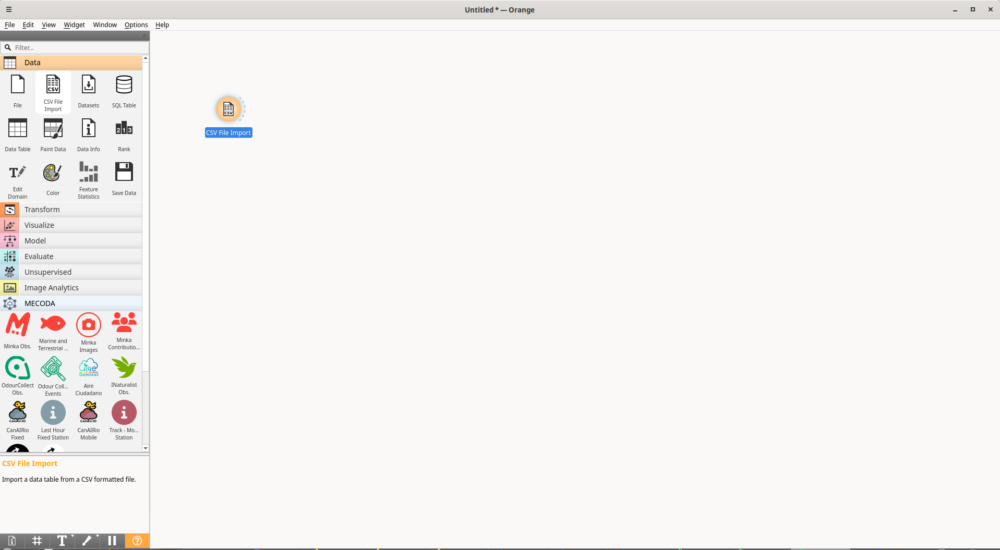

Al hacer doble clic sobre él vemos que abren las opciones. Si vamos a la carpeta que se encuentra en la esquina superior derecha podremos navegar hasta el csv en nuestro ordenador y así cargarlo.

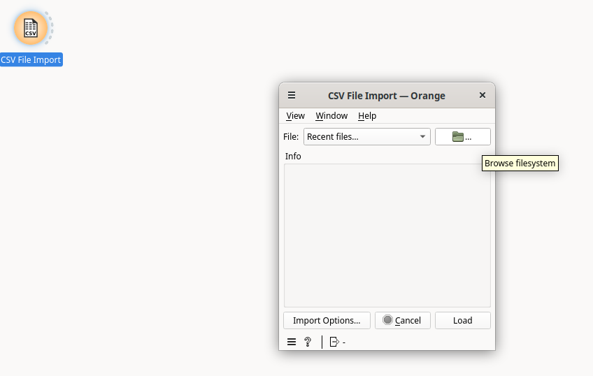

Lo siguiente que haremos será pinchar en "Import options" para determinar el tipo de las columnas con las que vamos a trabajar. De esta forma, las podremos utilizar en nuestro workflow.

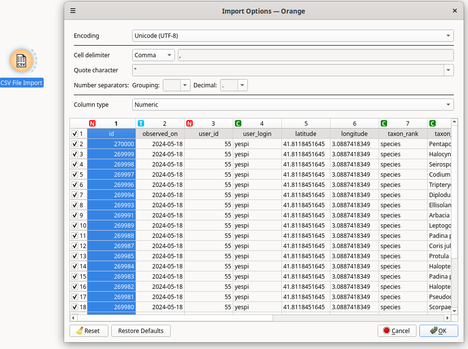

Pinchamos sobre cada columna y elegimos el tipo de dato que contiene:
- Numeric: para datos numéricos
- Datetime: para fechas
- Text: esta columna se considerará texto y se descartará para los procesos de agrupación y análisis.
- Categorical: esta columna, a pesar de ser de texto, se considera que indica una categoría (un nombre de usuario, un nombre de especie,...), por lo tanto se podrá incluir en las agrupaciones y análisis.
- Ignore: se ignorará esta columna en la carga de los datos.

Una vez hemos determinado el tipo de datos conectamos "Data table" para explorar el resultado.

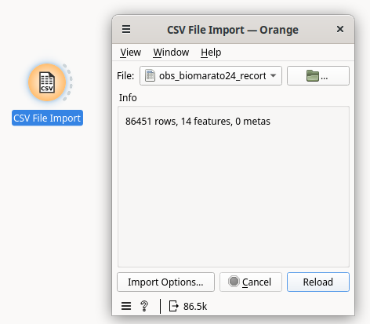

## ¿He hecho alguna primera observación de una especie en la BioMARató 2024?

Para responder a esta pregunta, podemos utilizar el widget "Unique", que nos permite quedarnos con los registros de cada grupo, en función del criterio que elijamos. En este caso podemos agrupar por los valores de "taxon_name" que indica la especie y quedarnos con el primer registro para cada uno. Dado que los datos están  ordenados por fecha, será el primer registro de una especie en este conjunto de datos. 

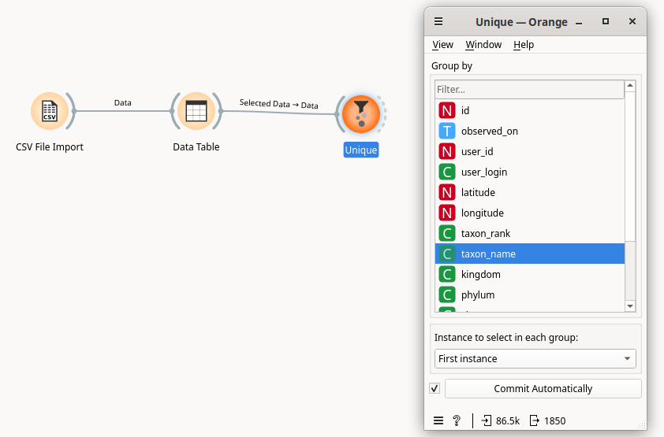

Como vemos, elegimos la columna "taxon_name" en "Group by" y "First instance" en el campo "Instance to select to each group".

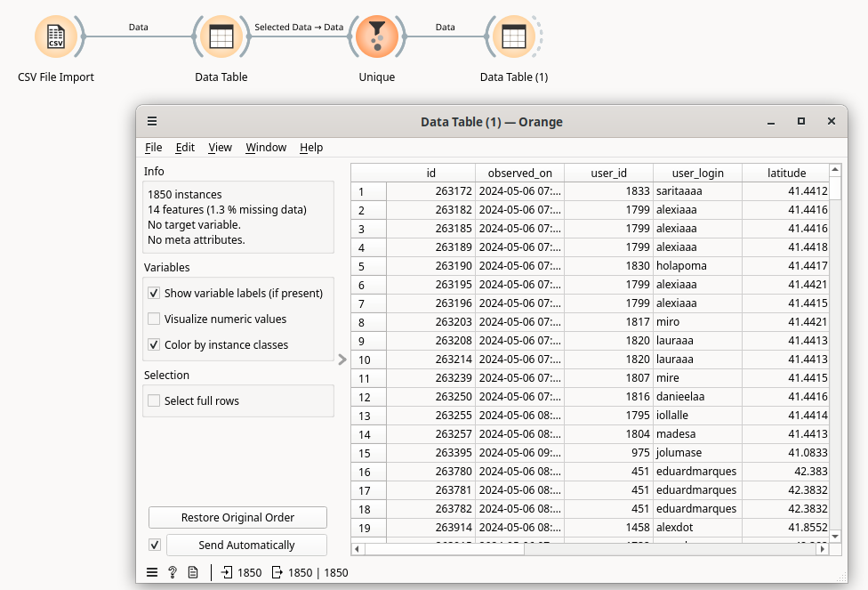

El resultado es la primera observación de cada una de las 1850 especies registradas.

Si le conectamos el widget "Select rows" podremos quedarnos con aquellos que son nuestros. 

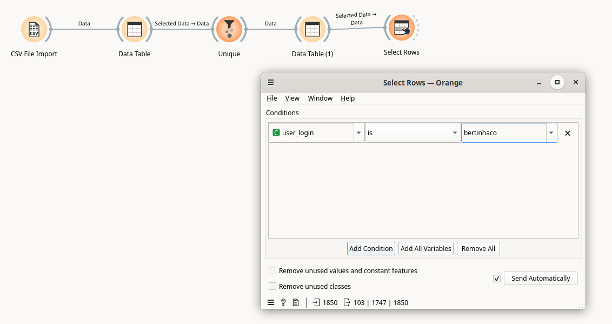

También podemos conectar "Group by" para contar el número de primeros registros de cada usuario y ver quién tiene más.

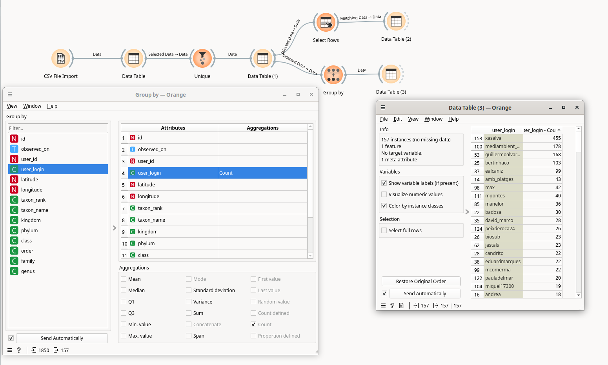

## Convertir coordenadas geográficas a provincias o países

Vemos que en nuestra tabla tenemos casi 90.000 observaciones con un dato geográfico de longitud-latitud. Pero tal vez queramos saber cuántas observaciones tenemos en cada provincia. Tenemos un widget para convertir los datos geográficos en demarcaciones administrativas. Se llama "Geocoding". Podemos conectar nuestro CSV cargado con "Geocoding":

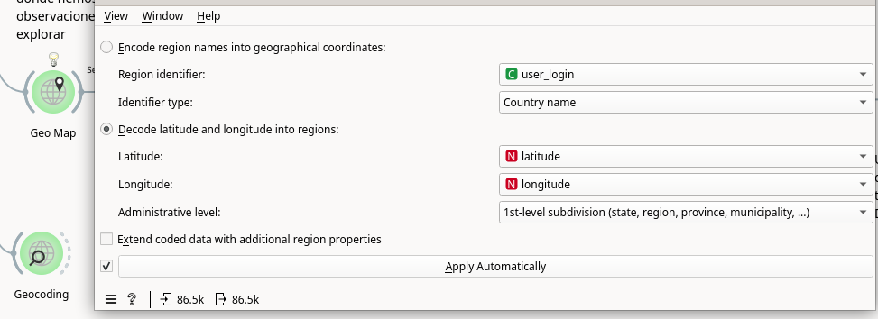

Debemos seleccionar la opción "Decode latitude and longitude into regions", seleccionar la columna donde aparece la latitud y la columna con la longitud (si no las detecta automáticamente) y luego seleccionar el nivel administrativo (Country / 1st-level subdivision, que se corresponde aquí con las provincias).

El resultado es una nueva columna que aparecerá así:

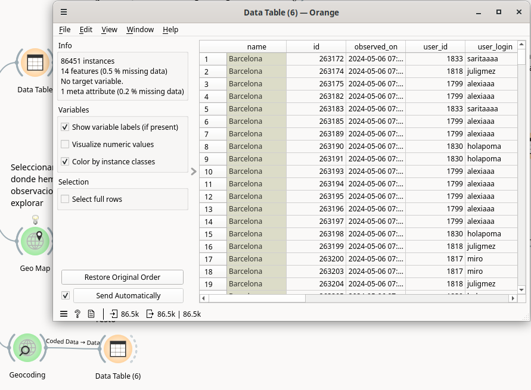

A partir de esta columna podemos crear otras columnas de texto, usando "Create class":

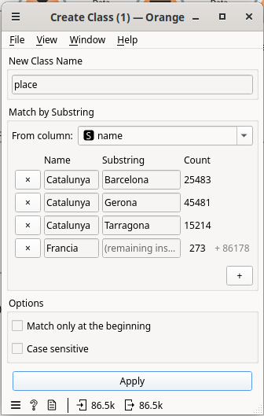

## Especies no registradas por mí en mi zona de observación

Lo primero que hacemos es conectar el widget "Geo Map" para seleccionar un área donde hemos registrado observaciones y en la que queremos comparar nuestras especies con las de otros usuarios/as.

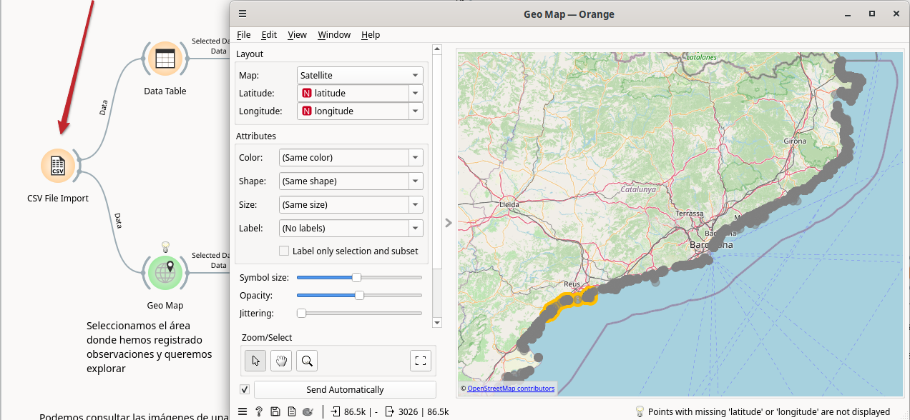

Con la tabla de observaciones resultante vamos a separar qué observaciones son nuestras y cuáles no, usando "Select rows":

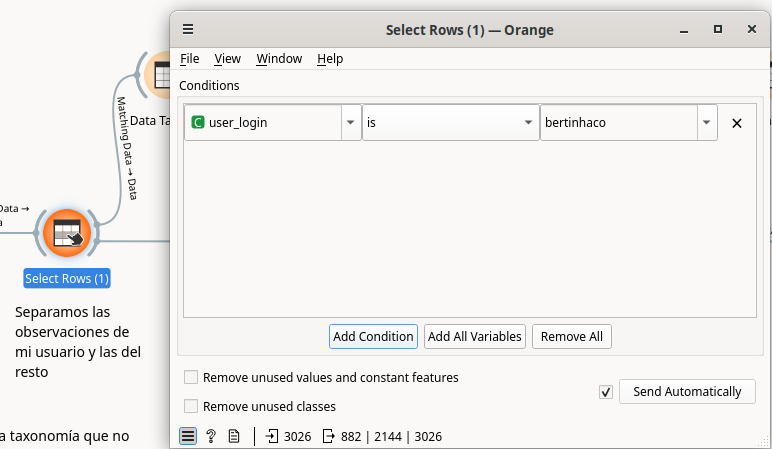

De la tabla con nuestras observaciones, extraemos las especies que sí hemos registrado, usando "Unique". Nos quedamos con un valor único por especie:

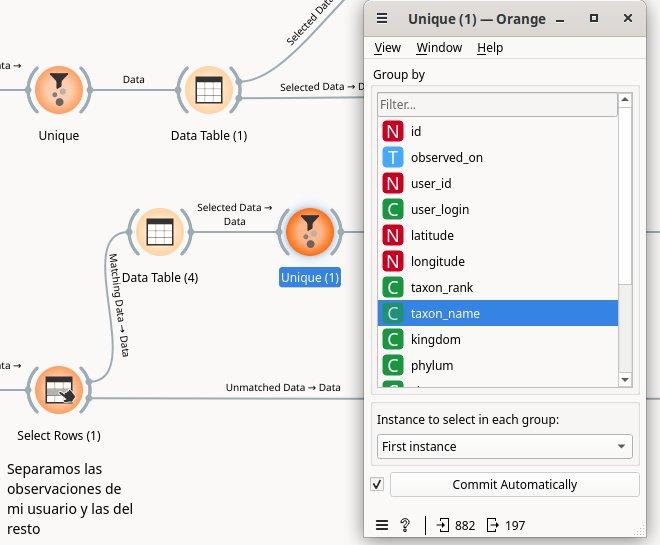

Nos quedamos con la columna "taxon_name" únicamente, usando "Select column":

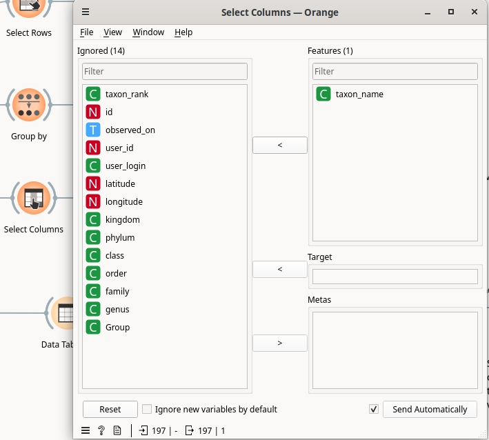

Y ahora creamos otra columna que nos sirva para filtrar las especies vistas cuando unamos esta tabla con la de todo el resto de usuarios/as.

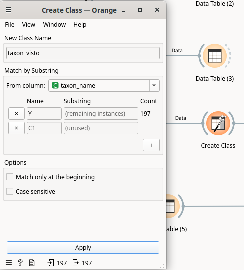

El resultado es una tabla con dos columnas: una con los nombres de las taxonomías vistas y otro con la columna que nos hará de filtro. Usaremos el widget "Merge Data" para unir ambas tablas. Primero conectaremos la tabla de observaciones de otros usuarios y luego conectaremos la tabla de taxonomías vistas (conexión de tipo Extra data para esta tabla). 

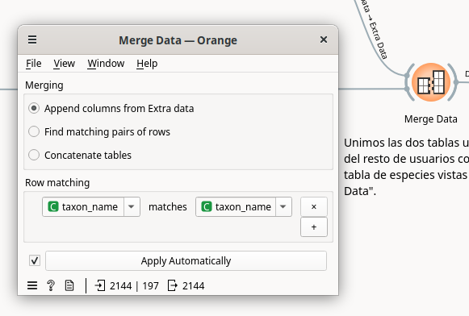

En el widget "Merge data" debemos indicar la opción "Append columns from Extra data" y en Row matching emparejar las filas por "taxon_name". El resultado es una tabla donde se añadirá una nueva columna "visto" donde el valor será "Y" o el que hagamos indicado para todas aquellas observaciones donde el "taxon_name" esté presente en la tabla vista.

## Workflow resultante

El workflow resultante de este ejercicio lo podéis encontrar [aquí](workflows/datathon_feb25_biomarato_part2.ows) y descargarlo para abrirlo dentro de vuestro Orange.

# 

&nbsp;&nbsp;&nbsp;&nbsp;&nbsp;&nbsp;&nbsp;&nbsp;&nbsp;&nbsp;&nbsp;&nbsp;

